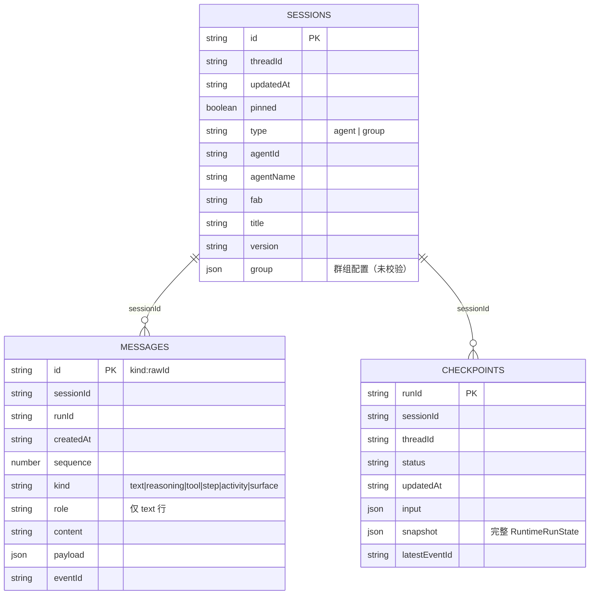

# AgentDock IndexedDB 会话存储方案分析（含代码参考）

> 日期：2026-08-20
> 范围：会话 / 消息 / Run 检查点在 IndexedDB 的落库设计，对照当前页面组织（按会话看历史、Agent Space 看该 Agent 的会话历史、群组历史）评估“够不够用”，并给出**带详细代码参考**的分阶段演进方案。
> 结论速览：**按会话看历史的设计充分且合理**；**Agent Space 的按 Agent 会话历史“功能可用，但未按该场景建模”**——缺少 `[agentId+fab]` 索引、话题列表固定 30 条截断、checkpoint 只增不删。建议按第 7 节 A 方案做最小改造，B/C 按产品演进。
> 本文所有“现状”代码均标注文件与行号；所有“方案”代码为可直接落地的参考实现，路径沿用现有模块（`src/api/session/sessionHistoryService.ts` 等）。

---

## 1. 背景：当前页面组织与历史入口

当前有 3 类“历史”入口，全部落在同一个 IndexedDB（Dexie）：

| 入口 | 路由 | 数据形态 | 核心查询 | 代码位置 |
|---|---|---|---|---|
| Home 最近会话 | `/chat`、HomeSidebar | 全部会话（agent + group）按更新时间倒序 | `listSessions()` | `src/api/session/sessionHistoryService.ts:55` |
| 按会话看历史 | `/chat/:id`、`/group/:id` | 该会话全部消息（文本 + 过程块）按 sequence 顺序 | `getMessages(sessionId)` | `sessionHistoryService.ts:60` |
| Agent Space 话题 | `/chat/:id` 左侧 AgentSidebar | 同一 Agent（`agentId + fab`）的历史会话（话题） | `listSessions()` + JS filter | `src/components/shell/AgentSidebar/Body.tsx:43-51` |
| 群组历史 | `/group`、GroupSidebar | `type === 'group'` 的会话 | `listSessions()` + JS filter | `src/components/shell/GroupSidebar/Body.tsx:55-63`、`src/features/group/GroupHomePage.tsx:45` |
| 断线恢复 | 会话页进入时 | 该会话最近一次可恢复的 Run 快照 | `getLatestRecoverableRun(sessionId)` | `sessionHistoryService.ts:200`、`src/stores/runStore.ts:13` |

说明：所谓“Agent Space”目前就是进入某个 Agent 的单聊会话页后，左侧栏展开的“该 Agent 的话题列表”，没有独立的 Agent 目录页。

---

## 2. 现状：数据库与表结构（含代码）

**数据库名**：`agentdock-session-v3`（Dexie schema 版本目前为 `version(1)`；库名里的 v3 是历史遗留命名，不代表 schema 版本）。

### 2.1 表定义与实体（现状代码）

`src/api/session/sessionHistoryService.ts:3-10`：

```ts
export interface SessionRecord {
  agentId?: string;
  agentName?: string;
  createdAt: string;
  fab: string;
  group?: unknown;          // 群组配置整体 JSON，无 schema 校验
  id: string;
  pinned: boolean;          // 有索引，当前无 UI 使用
  threadId: string;
  title: string;
  type: 'agent' | 'group';
  updatedAt: string;
  version?: string;
}

export type SessionMessageKind = 'activity' | 'reasoning' | 'step' | 'surface' | 'text' | 'tool';

export interface SessionMessageRecord {
  content?: string;
  createdAt: string;
  id: string;               // 主键 = `${kind}:${rawId}`，如 text:uuid
  kind: SessionMessageKind;
  payload?: Record<string, unknown>;
  role?: RuntimeMessage['role'];  // 仅 text 行
  runId?: string;
  sequence: number;         // 同一会话内排序
  sessionId: string;
  eventId?: string;
}

export interface RunCheckpointRecord {
  input: RunAgentInput;
  latestEventId?: string;
  runId: string;
  sessionId: string;
  snapshot: RuntimeRunState; // 完整快照
  status: RuntimeRunState['status'];
  threadId: string;
  updatedAt: string;
}

class SessionDatabase extends Dexie {
  sessions!: EntityTable<SessionRecord, 'id'>;
  messages!: EntityTable<SessionMessageRecord, 'id'>;
  checkpoints!: EntityTable<RunCheckpointRecord, 'runId'>;

  constructor() {
    super('agentdock-session-v3');
    this.version(1).stores({
      sessions: 'id,threadId,updatedAt,pinned,type',
      messages: 'id,sessionId,runId,createdAt,sequence',
      checkpoints: 'runId,sessionId,threadId,status,updatedAt',
    });
  }
}
```



### 2.2 数据生命周期（现状代码）

```text
新建会话（Home / AgentSpace / 群组向导）
  → createSession → sessions.put + 广播 sessions-changed

发送消息
  → runStore.execute（src/stores/runStore.ts:10-20）
      → 每收到流式事件 scheduleRunCheckpoint（350ms 防抖，sessionHistoryService.ts:204-210）
      → 流结束 flushRunCheckpoint（sessionHistoryService.ts:212-219）
      → saveRunCheckpoint（sessionHistoryService.ts:130-139）
          ├─ checkpoints.put（整份快照）
          ├─ persistRunSnapshot（sessionHistoryService.ts:141-197）：重写该会话全部 messages 行
          │     （已存在行保留原 sequence/createdAt/runId，避免多轮顺序错乱）
          ├─ sessions.update updatedAt
          └─ 广播 sessions-changed / run-persisted

停止 / 出错
  → runStore.stop / execute catch 里显式 saveRunCheckpoint（status=cancelled / error）

删除会话
  → removeSession（sessionHistoryService.ts:58）：事务内级联删除 sessions + messages + checkpoints
```

`persistRunSnapshot` 关键片段（`sessionHistoryService.ts:141-197`，多轮顺序不乱的实现）：

```ts
async persistRunSnapshot(sessionId: string, snapshot: RuntimeRunState) {
  const existingRows = await db.messages.where('sessionId').equals(sessionId).toArray();
  const existingById = new Map(existingRows.map((record) => [record.id, record]));
  const records: SessionMessageRecord[] = [];
  const push = (kind, id, value) => {
    const key = `${kind}:${id}`;
    const existing = existingById.get(key);
    records.push({
      ...value,
      createdAt: existing?.createdAt ?? new Date().toISOString(),
      id: key,
      kind,
      runId: existing?.runId ?? snapshot.runId,
      sequence: existing?.sequence ?? nextSequence(),
      sessionId,
    });
  };
  // 只持久化 user/assistant 文本；reasoning/tool/step/activity/surface 各自 push
  for (const message of Object.values(snapshot.messages)) {
    if (!message || !message.id) continue;
    if (message.role !== 'user' && message.role !== 'assistant') continue;
    push('text', message.id, { content: message.content, role: message.role, runId: snapshot.runId, eventId: message.eventId ?? snapshot.latestEventId });
  }
  // ... reasoning / toolCalls / steps / activities / surfaces 同样 push
  if (records.length) await db.messages.bulkPut(records);
}
```

---

## 3. 查询矩阵与效率评估

| 场景 | 实现查询 | 是否走索引 | 复杂度 | 代码位置 |
|---|---|---|---|---|
| Home 最近会话 | `sessions.orderBy('updatedAt').reverse()` | ✅ `updatedAt` | O(n)，n=会话数 | `sessionHistoryService.ts:55` |
| 按会话历史 | `messages.where('sessionId').sortBy('sequence')` | ✅ `sessionId` | O(该会话消息数) | `sessionHistoryService.ts:60` |
| 最新 Run | `checkpoints.where('sessionId').sortBy('updatedAt')` | ✅ `sessionId` | O(该会话 run 数) | `sessionHistoryService.ts:199` |
| 可恢复 Run | 同上 + `status∈{running,paused}` | ✅ | O(该会话 run 数) | `sessionHistoryService.ts:200` |
| Agent Space 话题 | `listSessions()` + filter `type=agent && agentId && fab` | ❌ 全表扫描 | O(全部会话数) | `AgentSidebar/Body.tsx:43-51` |
| 群组历史 | `listSessions()` + filter `type=group` | ⚠️ `type` 有索引但代码未用 | O(全部会话数) | `GroupSidebar/Body.tsx:55-63` |
| 会话搜索 | `listSessions()` + title/agentName 模糊 | ❌ 全表扫描 | O(全部会话数) | `sessionHistoryService.ts:56` |
| 删除/编辑消息 | `messages.get('text:'+id)` 等前缀查找 | ✅ 主键 | O(1) + 过程块扫描 | `sessionHistoryService.ts:65-98,110-128` |
| 删除整轮 | `messages.where('runId')` | ✅ `runId` | O(该 run 行数) | `sessionHistoryService.ts:100-108` |

**结论**：读多写多的主链路（按会话历史、恢复、级联删除）都建了索引；**唯独“按 Agent 聚合会话”这个 Agent Space 的核心场景没有建模**，目前靠全表扫描兜底。

---

## 4. 模型设计评估（规范性）

### 4.1 会话身份：合理

“一个话题 = 一个 Session”与页面组织一致；Agent 身份冗余在会话行（`agentId + fab`），按 Agent 过滤不需要 join 市场服务。跨 FAB 的同名 Agent 是不同身份（`agentFullName` 含 fab），语义清晰。

### 4.2 消息主键 `kind:rawId`：功能正常，但约定脆弱

现状依赖三类前缀约定（`sessionHistoryService.ts`）：

- `removeMessage` / `removeMessages`（`:65-98`）：先按 `text:${id}` 找文本行，再向后删除同轮过程块；
- `removeTurn`（`:100-108`）：依赖 `runId` 整轮删除；
- `updateMessageContent`（`:110-128`）：同时改消息行与 checkpoint 快照。

这些逻辑隐式依赖“id 前缀”与“文本在前、过程块在后”的存储顺序，目前自洽；但未来要支持“回复某条消息”“消息引用”“跨轮编辑”时，裸 `rawId` 提取与重建会成为维护成本。建议至少把 raw `messageId` 抽成独立字段，前缀仅作展示键（见 7.B3）。

### 4.3 `sequence`：按会话排序足够

`sequence = Date.now()*1000 + 0..999 自增种子`（`sessionHistoryService.ts:44-45`），同一会话内单调递增；`persistRunSnapshot` 对已存在行保留原 sequence（这是近期修过的坑，见提交 `fb767aa`）。跨会话不存在全局顺序需求，无需全局自增。

### 4.4 `threadId / runId / eventId`：职责清晰

- `threadId` 随会话固化，同一会话所有 Run 共用（DeepAgents 上下文线程）；
- `runId` 每次发送新生成，HITL 续跑沿用同一 run；
- `eventId` 用于断线游标恢复（`runStore.ts:13` → `getLatestRecoverableRun` → `resume`）。

### 4.5 群组配置 `group: unknown`：无校验

群组配置（成员、编排模式、config）整体以 JSON 存进 `group` 字段（`sessionHistoryService.ts:3`），页面读取时直接断言类型（如 `src/features/group/GroupChatPage.tsx` 里 `session.group as StoredGroupConfig`）。字段演进时旧数据与代码强转可能失配，建议引入 zod schema + 版本号（见 7.B3）。

### 4.6 `pinned`：有索引无功能

`pinned` 已在索引里，但当前 UI 没有置顶交互，属预留字段。若长期不用可移除，避免误导。

---

## 5. 场景充分性分析（“够用吗”）

### 5.1 按会话看历史 —— ✅ 充分

主键定位会话、`sessionId` 索引取消息、`sequence` 排序、checkpoint 回放，链路完整；编辑 / 删除 / 分支替换 / 断线恢复都基于同一模型实现（`ChatPage.tsx:210,219,228,340,351` 统一走 `getMessages`）。

### 5.2 Agent Space 看该 Agent 的会话历史 —— ⚠️ 可用但未建模

现状代码（`src/components/shell/AgentSidebar/Body.tsx:43-51`）：

```ts
// 话题 = 同一 Agent（agentId + fab）的历史会话，来自 IndexedDB（兼容现有落库）。
const topics = useMemo(() => {
  const query = keyword.toLowerCase();
  return sessions
    .filter((session) => session.type === 'agent' && session.agentId === agentId && session.fab === fab)
    .filter((session) => !query || `${session.title}${agentName}`.toLowerCase().includes(query))
    .sort((left, right) => new Date(right.updatedAt).getTime() - new Date(left.updatedAt).getTime())
    .slice(0, 30);
}, [agentId, agentName, fab, keyword, sessions]);
```

两个具体问题：

1. **无索引**：`sessions` 没有 `agentId` / `[agentId+fab]` 索引，`sessions` 来自 `listSessions()`（`:30`）全表拉取。会话数上千、Agent 几十个后，每次进入会话页都会扫全表，且该查询在 `focus/visibilitychange/sessions-changed` 时反复触发。
2. **30 条截断**：`slice(0, 30)` 且无“加载更多”。一个 Agent 超过 30 个话题后，更早的会话历史在 Agent Space 里**不可达**——与“进入 Agent Space 看此 Agent 的 session 历史”的目标直接冲突。

### 5.3 群组历史 —— ⚠️ 可用，建议顺手用上 `type` 索引

`type` 已在索引中，但 GroupSidebar / GroupHomePage 仍是 `listSessions()` + filter；且分别截断 20 / 10 条（`GroupSidebar/Body.tsx:62`、`GroupHomePage.tsx:45`），存在“旧群组不可达”问题。

### 5.4 会话搜索 —— ⚠️ 全表扫描，当前可接受

标题 / Agent 名模糊匹配在 JS 层完成（`sessionHistoryService.ts:56`）；Dexie 不支持全文索引，会话量不大时这是合理取舍。若未来会话上万，再考虑独立搜索索引表（见 7.C2）。

### 5.5 断线恢复 —— ✅ 充分

checkpoint 按 `sessionId` 索引、`updatedAt` 排序取最新，`running/paused` 可恢复；删除消息会联动清理相关 checkpoint，避免“已删消息从快照复活”。

### 5.6 多标签页 —— ✅ 已处理

`blocked` / `versionchange` 监听 + 阻塞诊断告警已实现（`sessionHistoryService.ts:18-29`），schema 升级时旧标签页会主动释放连接。

### 5.7 未来场景预判 —— ❌ 当前设计不支持

| 未来需求 | 现状 | 需要的演进 |
|---|---|---|
| Agent 目录页（列出全部 Agent + 会话数/最近会话） | 需扫全表 + 按 `agentId+fab` 聚合 | `agents` 表或 `[agentId+fab]` 索引 + 聚合 |
| 跨会话搜某 Agent 的消息 | messages 无 `agentId`，需 join sessions | messages 冗余 `agentId+fab` 并加索引 |
| 会话归档 / 软删除 | 硬删除 | `archivedAt` / `deletedAt` 字段 + 索引 |
| 置顶 / 星标 | `pinned` 已有字段但无 UI | 接线即可 |

---

## 6. 容量与性能风险

1. **checkpoint 只增不删**：每次 Run（含 stop / error 终态）都会写入一条完整快照（`saveRunCheckpoint` / `runStore.stop`），且无清理策略。会话长期使用后，checkpoint 数量 = run 次数，每条快照体积可能很大（完整 `RuntimeRunState`）。
2. **消息行重复全量重写**：`persistRunSnapshot` 每次 flush 都重写该会话全部消息行（保留原 sequence 但仍是“读全量 + bulkPut 全量”）。会话消息上千条后，每次流式结束都会有一次全量写。
3. **列表截断汇总**：HomePage 8（`HomePage.tsx:69`）、GroupHomePage 10（`:45`）、GroupSidebar 20（`:62`）、HomeSidebar 20（`HomeSidebar/Body.tsx:140`）、AgentSidebar 30（`:50`）。截断上限本身合理（侧栏 UI 需要），但缺少“查看全部 / 加载更多”的出口。
4. **sequence 时间戳种子**：`Date.now()*1000 + 0..999`，同一毫秒内多行由种子区分；多标签页同时写同一会话存在极小概率种子碰撞（当前无并发写同一会话场景，风险可忽略，但值得记录）。

---

## 7. 建议方案（含详细代码参考）

### 方案 A：短期最小改造（强烈建议）

#### A1. Dexie 升 `version(2)`，为 sessions 增加 Agent 索引

修改 `src/api/session/sessionHistoryService.ts:7-17`：

```ts
class SessionDatabase extends Dexie {
  sessions!: EntityTable<SessionRecord, 'id'>;
  messages!: EntityTable<SessionMessageRecord, 'id'>;
  checkpoints!: EntityTable<RunCheckpointRecord, 'runId'>;

  constructor() {
    super('agentdock-session-v3');
    this.version(1).stores({
      sessions: 'id,threadId,updatedAt,pinned,type',
      messages: 'id,sessionId,runId,createdAt,sequence',
      checkpoints: 'runId,sessionId,threadId,status,updatedAt',
    });
    // 新增 agentId / fab / [agentId+fab] 复合索引；同库名 version bump 保留现有数据。
    this.version(2).stores({
      sessions: 'id,threadId,updatedAt,pinned,type,agentId,fab,[agentId+fab]',
      messages: 'id,sessionId,runId,createdAt,sequence',
      checkpoints: 'runId,sessionId,threadId,status,updatedAt',
    });
  }
}
```

> Dexie 注意事项：
> - 每个新版本要**完整列出需要保留的所有表**，Dexie 会按版本合并索引，已存在数据自动保留。
> - 已有 `db.on('blocked')` / `db.on('versionchange')`（`:18-29`）已覆盖多标签页升级：旧标签页会收到 `versionchange` 并 `close()`。
> - 不建议改库名（如 `agentdock-session-v4`）来迁移，那会丢失全部本地历史。

#### A2. Service 增加按 Agent / 群组查询与分页

在 `sessionHistoryService` 对象（`:54` 起）中新增：

```ts
/** 某 Agent（agentId + fab）的全部历史会话，按更新时间倒序，走 [agentId+fab] 索引。 */
async listSessionsByAgent(agentId: string, fab: string) {
  const rows = await db.sessions.where('[agentId+fab]').equals([agentId, fab]).toArray();
  return rows.sort((a, b) => new Date(b.updatedAt).getTime() - new Date(a.updatedAt).getTime());
},

/** 全部群组会话，按更新时间倒序，走 type 索引。 */
async listGroupSessions() {
  const rows = await db.sessions.where('type').equals('group').toArray();
  return rows.sort((a, b) => new Date(b.updatedAt).getTime() - new Date(a.updatedAt).getTime());
},

/** Agent 话题分页：offset=0 为第一页；关键词过滤在内存层做（按 Agent 维度，量级可控）。 */
async listTopicsByAgent(agentId: string, fab: string, offset = 0, limit = 30) {
  const rows = await this.listSessionsByAgent(agentId, fab);
  return {
    hasMore: offset + limit < rows.length,
    items: rows.slice(offset, offset + limit),
    total: rows.length,
  };
},
```

#### A3. AgentSidebar 改用索引查询 + “加载更多”

`src/components/shell/AgentSidebar/Body.tsx` 改法（替换 `:23-51` 的加载与 useMemo）：

```tsx
const TOPIC_PAGE_SIZE = 30;

// 只加载当前 Agent 的会话（走 [agentId+fab] 索引），不再全表拉取。
const [agentSessions, setAgentSessions] = useState<SessionRecord[]>([]);
const [topicPage, setTopicPage] = useState(0);
const [searching, setSearching] = useState(false); // 关键词过滤后无法走索引分页，改用客户端分页

useEffect(() => {
  const load = () => {
    void sessionHistoryService.listSessionsByAgent(agentId, fab).then(setAgentSessions);
  };
  load();
  window.addEventListener('agentdock:sessions-changed', load);
  window.addEventListener('focus', load);
  document.addEventListener('visibilitychange', load);
  return () => {
    window.removeEventListener('agentdock:sessions-changed', load);
    window.removeEventListener('focus', load);
    document.removeEventListener('visibilitychange', load);
  };
}, [agentId, fab]);

const visibleTopics = useMemo(() => {
  const query = keyword.toLowerCase();
  const filtered = agentSessions.filter(
    (session) => !query || `${session.title}${agentName}`.toLowerCase().includes(query),
  );
  return {
    hasMore: (topicPage + 1) * TOPIC_PAGE_SIZE < filtered.length,
    items: filtered.slice(0, (topicPage + 1) * TOPIC_PAGE_SIZE),
  };
}, [agentName, agentSessions, keyword, topicPage]);
```

渲染处把 `topics` 换成 `visibleTopics.items`，列表底部增加：

```tsx
{visibleTopics.hasMore && (
  <Button
    block
    size="small"
    type="text"
    onClick={() => setTopicPage((page) => page + 1)}
  >
    {t('common.loadMore')}（{visibleTopics.items.length} / {agentSessions.length}）
  </Button>
)}
```

（`common.loadMore` 为新增 i18n key，需同步 18 份词典，见 A5。）

#### A4. 群组列表改用 `type` 索引查询

`GroupSidebar/Body.tsx:31,55-63` 与 `GroupHomePage.tsx:29,45` 均把 `listSessions()` 改为 `listGroupSessions()`，并按 A3 同款“加载更多”处理 20 / 10 条截断：

```tsx
// GroupSidebar/Body.tsx
void sessionHistoryService.listGroupSessions().then(setGroups);

const visibleGroups = useMemo(() => {
  const query = keyword.toLowerCase();
  const filtered = groups.filter((session) => !query || session.title.toLowerCase().includes(query));
  return {
    hasMore: (groupPage + 1) * GROUP_PAGE_SIZE < filtered.length,
    items: filtered.slice(0, (groupPage + 1) * GROUP_PAGE_SIZE),
  };
}, [groups, keyword, groupPage]);
```

#### A5. i18n 补充

18 份词典各增加一个 key：

```ts
'common.loadMore': 'Load more',        // en-US
'common.loadMore': '加载更多',          // zh-CN
// ...其余语言同理（词典 key 集合由 src/i18n/dictionaries.test.ts 守护）
```

#### A 方案验收点

- [ ] 升级后旧数据完整保留（会话、消息、checkpoint 均可读，恢复功能正常）。
- [ ] Agent Space 话题查询不再全表扫描（DevTools 里确认走 `[agentId+fab]` 索引）。
- [ ] Agent 话题超过 30 条时可“加载更多”看到全部。
- [ ] `pnpm typecheck`、`pnpm test`、`pnpm build` 通过。

---

### 方案 B：中期健康度

#### B1. checkpoint 终态清理

在 `saveRunCheckpoint`（`sessionHistoryService.ts:130-139`）写库后追加清理：

```ts
const KEEP_TERMINAL_CHECKPOINTS = 5;

/** 终态（success/cancelled/error）只保留最近 N 条；running/paused 始终保留（断线恢复依赖）。 */
async pruneCheckpoints(sessionId: string) {
  const rows = await db.checkpoints.where('sessionId').equals(sessionId).sortBy('updatedAt');
  const recoverable = new Set(
    rows.filter((record) => record.status === 'running' || record.status === 'paused').map((r) => r.runId),
  );
  const terminal = rows.filter((record) => !recoverable.has(record.runId));
  if (terminal.length <= KEEP_TERMINAL_CHECKPOINTS) return;
  const keep = new Set(terminal.slice(-KEEP_TERMINAL_CHECKPOINTS).map((r) => r.runId));
  await db.checkpoints.bulkDelete(terminal.filter((r) => !keep.has(r.runId)).map((r) => r.runId));
},

async saveRunCheckpoint(sessionId, input, snapshot) {
  const updatedAt = new Date().toISOString();
  const record: RunCheckpointRecord = { input, latestEventId: snapshot.latestEventId, runId: snapshot.runId, sessionId, snapshot, status: snapshot.status, threadId: snapshot.threadId, updatedAt };
  await db.checkpoints.put(record);
  await this.pruneCheckpoints(sessionId);
  await this.persistRunSnapshot(sessionId, snapshot);
  await db.sessions.update(sessionId, { updatedAt });
  notifySessionsChanged();
  notifyRunPersisted();
  return record;
},
```

> 影响面：`getLatestRun`（刷新回放）只依赖“最新一条”，保留最近 N 条终态足够；`getLatestRecoverableRun`（断线恢复）只依赖 running/paused，不受影响。

#### B2. persistRunSnapshot 差量 upsert（减少全量重写）

当前实现每次读全量 + `bulkPut` 全量（`:141-197`）。改为“新增 bulkPut + 变更行 bulkPut”：

```ts
async persistRunSnapshot(sessionId: string, snapshot: RuntimeRunState) {
  const existingRows = await db.messages.where('sessionId').equals(sessionId).toArray();
  const existingById = new Map(existingRows.map((record) => [record.id, record]));
  const toPut: SessionMessageRecord[] = [];
  const push = (kind, id, value) => {
    const key = `${kind}:${id}`;
    const existing = existingById.get(key);
    const next: SessionMessageRecord = {
      ...value,
      createdAt: existing?.createdAt ?? new Date().toISOString(),
      id: key,
      kind,
      runId: existing?.runId ?? snapshot.runId,
      sequence: existing?.sequence ?? nextSequence(),
      sessionId,
    };
    // 无变化行跳过；payload 为对象，用序列化比较判断是否真的变了。
    if (existing && JSON.stringify(existing) === JSON.stringify(next)) return;
    toPut.push(next);
  };
  // ... 各消息/过程块 push 逻辑不变
  if (toPut.length) await db.messages.bulkPut(toPut);
}
```

> 收益：多轮历史很长但本轮无变化时，几乎零写入；代价是每次 JSON.stringify 比较（消息量大时 O(行数)，仍比全量 IndexedDB 写便宜）。

#### B3. 消息冗余 `agentId+fab` + group 配置 schema 化

若产品确定要“跨会话按 Agent 搜消息 / Agent Space 展示消息摘要”，为 messages 增加冗余字段与索引：

```ts
export interface SessionMessageRecord {
  // ...现有字段
  agentId?: string;   // 冗余：写入时从 session 带出
  fab?: string;
}

// SessionDatabase version(3)
this.version(3).stores({
  sessions: 'id,threadId,updatedAt,pinned,type,agentId,fab,[agentId+fab]',
  messages: 'id,sessionId,runId,createdAt,sequence,agentId,fab,[agentId+fab]',
  checkpoints: 'runId,sessionId,threadId,status,updatedAt',
});

// persistRunSnapshot 写入前取一次 session，填充冗余字段
async persistRunSnapshot(sessionId: string, snapshot: RuntimeRunState) {
  const session = await db.sessions.get(sessionId);
  const agentId = session?.agentId;
  const fab = session?.fab;
  // push('text', id, { ...value, agentId, fab })；其余 kind 同理
}
```

group 配置引入 zod 校验（`zod` 已是依赖）：

```ts
// 建议新文件 src/api/session/groupSchema.ts
import { z } from 'zod';

export const GroupMemberSchema = z.object({
  agentId: z.string(),
  fab: z.string(),
  version: z.string().optional(),
});

export const GroupConfigSchema = z.object({
  config: z.record(z.unknown()).optional(),
  members: z.array(GroupMemberSchema).min(2),
  orchestrationMode: z.string(),
  schemaVersion: z.number().int().positive().optional(),
});

export type StoredGroupConfig = z.infer<typeof GroupConfigSchema>;

export const parseGroupConfig = (raw: unknown): StoredGroupConfig | null => {
  const result = GroupConfigSchema.safeParse(raw);
  if (!result.success) {
    console.warn('[AgentDock] invalid group config', result.error.issues);
    return null;
  }
  return result.data;
};
```

写入侧（GroupCreateModal / GroupChatPage）在 `session.group` 落库前 `GroupConfigSchema.parse(...)`；读取侧统一 `parseGroupConfig(session.group)`，失败走空态而不是强转崩溃。

#### B4. `pinned` 接线或移除

- 接线：HomeSidebar / AgentSidebar 置顶条目置顶排序，写入 `pinned: true`；
- 或移除索引：`sessions: 'id,threadId,updatedAt,type,agentId,fab,[agentId+fab]'`，避免无字段占用索引维护成本。

---

### 方案 C：长期产品化（Agent Space 目录页）

#### C1. `agents` 聚合表

```ts
export interface AgentSummaryRecord {
  agentId: string;
  agentName: string;
  fab: string;
  icon?: string;
  id: string;              // `${agentId}@${fab}`
  lastActiveAt: string;
  latestSessionId?: string;
  latestTitle?: string;
  sessionCount: number;
  version?: string;
}

class SessionDatabase extends Dexie {
  agents!: EntityTable<AgentSummaryRecord, 'id'>;
  // ...
  this.version(4).stores({
    sessions: 'id,threadId,updatedAt,pinned,type,agentId,fab,[agentId+fab]',
    messages: 'id,sessionId,runId,createdAt,sequence,agentId,fab,[agentId+fab]',
    checkpoints: 'runId,sessionId,threadId,status,updatedAt',
    agents: 'id,fab,lastActiveAt',
  });
}

// 会话写入/更新时维护聚合（createSession / updateSession / saveRunCheckpoint 里调用）
async touchAgentSummary(session: SessionRecord) {
  if (!session.agentId) return;
  const key = `${session.agentId}@${session.fab}`;
  const count = await db.sessions
    .where('[agentId+fab]')
    .equals([session.agentId, session.fab])
    .count();
  await db.agents.put({
    agentId: session.agentId,
    agentName: session.agentName || session.title,
    fab: session.fab,
    id: key,
    lastActiveAt: session.updatedAt,
    latestSessionId: session.id,
    latestTitle: session.title,
    sessionCount: count,
    version: session.version,
  });
},
```

目录页查询：

```ts
async listAgentSummaries() {
  return db.agents.orderBy('lastActiveAt').reverse().toArray();
},
```

> `sessionCount` 在 create/remove 后重算（走 `[agentId+fab]` 索引 count），不做增量计数器，避免删除场景的计数漂移。

#### C2. 跨会话消息搜索索引表（草图）

Dexie 无全文索引，中文分词更不可内建。若要全局搜索消息，建议独立搜索表：

```ts
export interface MessageSearchRecord {
  agentId?: string;
  createdAt: string;
  id: string;          // `${term}::${sessionId}::${messageId}`
  kind: string;
  messageId: string;
  sequence: number;
  sessionId: string;
  term: string;
}

// stores 增加：search: '[term+sessionId+messageId],sessionId,agentId,term'
```

- 写入：`persistRunSnapshot` 对 `text` 消息分词（英文按空白/小写，中文按字符 bigram），插入 `search` 行；
- 查询：`where('term').equals(token)`，再按 `sessionId / agentId` 过滤；
- 删除：随 `removeSession / removeMessages` 按 `sessionId` 级联。

#### C3. 会话归档 / 软删除

`SessionRecord` 增加 `archivedAt?: string`，索引 `archivedAt`；列表查询默认过滤 `archivedAt` 为空的行，删除改为“标记 + 延迟清理”：

```ts
async archiveSession(id: string) {
  await db.sessions.update(id, { archivedAt: new Date().toISOString() });
  notifySessionsChanged();
},
```

---

## 8. 迁移实施步骤与验收

### 实施步骤（按 A → B → C 顺序）

1. `SessionDatabase` 增加 `version(2).stores({...})`（完整列出三张表，A1）。
2. `sessionHistoryService` 增加 `listSessionsByAgent` / `listGroupSessions` / `listTopicsByAgent`（A2）。
3. AgentSidebar / GroupSidebar / GroupHomePage 改用新查询与“加载更多”（A3/A4）。
4. i18n 补 `common.loadMore`（A5）。
5. （B）`saveRunCheckpoint` 增加 `pruneCheckpoints`（B1）；`persistRunSnapshot` 差量 upsert（B2）；可选消息冗余 + zod group schema（B3）。
6. （C）`agents` 表与目录页（C1）、搜索索引表（C2，按产品需求）。
7. 全量回归：`pnpm typecheck`、`pnpm test`、`pnpm build`；浏览器 CDP 验证。

### 验收清单

- [ ] 升级后旧数据完整保留（会话、消息、checkpoint 均可读，恢复功能正常）。
- [ ] Agent Space 话题查询不再全表扫描（DevTools 里确认走 `[agentId+fab]` 索引）。
- [ ] Agent 话题超过 30 条时可“加载更多”看到全部。
- [ ] 删除会话 / 消息后索引数据同步清理，无孤儿行。
- [ ] 多标签页同时打开时升级不阻塞（blocked 提示 + 旧标签页释放连接）。
- [ ] checkpoint 清理后：终态 run 保留最近 N 条，`running/paused` 始终可恢复。
- [ ] 群组配置读取走 zod 校验，旧数据缺字段时回落空态而非崩溃。

---

## 9. 总结

- **当前设计对“按会话看历史”是充分且合理的**：索引、排序、恢复、级联删除都覆盖到位（`sessionHistoryService.ts` 主链路均有索引）。
- **对“Agent Space 看此 Agent 的会话历史”属于“能用但没建模”**：缺 `[agentId+fab]` 索引 + 30 条截断，是本次分析中最值得先改的两点（方案 A，改动集中在存储层与侧栏，风险低、收益明确）。
- 方案 B 解决长期健康度（checkpoint 膨胀、消息全量重写、group 配置无校验）；方案 C 支撑 Agent 目录页 / 跨会话搜索等产品化方向，按需求再决策。
