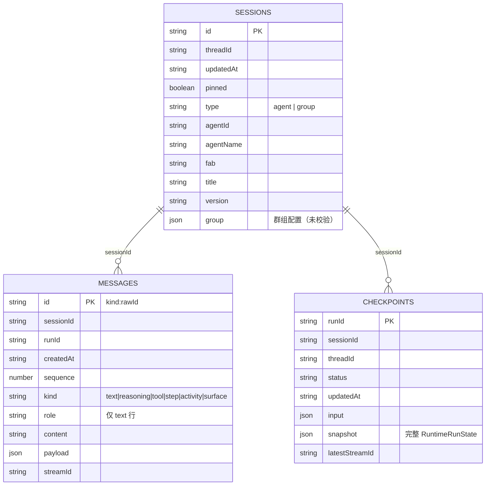

# AgentDock IndexedDB 会话存储方案分析

> 日期：2026-08-20
> 范围：会话 / 消息 / Run 检查点在 IndexedDB 的落库设计，对照当前页面组织（按会话看历史、Agent Space 看该 Agent 的会话历史、群组历史）评估“够不够用”，并给出分阶段演进方案。
> 结论速览：**按会话看历史的设计是充分且合理的**；**Agent Space 的按 Agent 会话历史“功能可用，但未按该场景建模”**——缺少 `[agentId+fab]` 索引、话题列表固定 30 条截断、checkpoint 只增不删。建议按第 7 节的 A 方案做最小改造，B/C 按产品演进。

---

## 1. 背景：当前页面组织与历史入口

当前有 3 类“历史”入口，全部落在同一个 IndexedDB（Dexie）：

| 入口 | 路由 | 数据形态 | 核心查询 |
|---|---|---|---|
| Home 最近会话 | `/chat`、HomeSidebar | 全部会话（agent + group）按更新时间倒序 | `listSessions()` |
| 按会话看历史 | `/chat/:id`、`/group/:id` | 该会话全部消息（文本 + 过程块）按 sequence 顺序 | `getMessages(sessionId)` |
| Agent Space 话题 | `/chat/:id` 左侧 AgentSidebar | 同一 Agent（`agentId + fab`）的历史会话（话题） | `listSessions()` + JS filter |
| 群组历史 | `/group`、GroupSidebar | `type === 'group'` 的会话 | `listSessions()` + JS filter |
| 断线恢复 | 会话页进入时 | 该会话最近一次可恢复的 Run 快照 | `getLatestRecoverableRun(sessionId)` |

说明：所谓“Agent Space”目前就是进入某个 Agent 的单聊会话页后，左侧栏展开的“该 Agent 的话题列表”，没有独立的 Agent 目录页。

---

## 2. 现状：数据库与表结构

**数据库名**：`agentdock-session-v3`（Dexie schema 版本目前为 `version(1)`；库名里的 v3 是历史遗留命名，不代表 schema 版本）。

**表定义**：

```ts
this.version(1).stores({
  sessions: 'id,threadId,updatedAt,pinned,type',
  messages: 'id,sessionId,runId,createdAt,sequence',
  checkpoints: 'runId,sessionId,threadId,status,updatedAt',
});
```



### 2.1 实体字段说明

- **SessionRecord**：一个“会话/话题”。`type` 区分 `agent` / `group`；Agent 身份通过 `agentId + fab` 冗余在会话行上（`agentFullName` 规范为 `{name}-{fab}`）；群组配置整体塞进 `group` 字段（类型是 `unknown`，无 schema 校验）。
- **SessionMessageRecord**：一条可见消息或一个过程块。`id` 采用 `kind:rawId` 前缀式主键（如 `text:uuid`、`reasoning:uuid`）；`sequence` 决定同一会话内的渲染顺序；`role` 只出现在 `text` 行（仅持久化 user / assistant，system/developer 上下文不落库）。
- **RunCheckpointRecord**：一次 Run 的完整快照（`snapshot: RuntimeRunState`），用于刷新后回放、断线恢复（`status=running/paused`）、HITL 续跑。

### 2.2 数据生命周期

```text
新建会话（Home / AgentSpace / 群组向导）
  → createSession → sessions.put + 广播 sessions-changed

发送消息
  → runStore.execute
      → 每收到流式事件 scheduleRunCheckpoint（350ms 防抖）
      → 流结束 flushRunCheckpoint
      → saveRunCheckpoint
          ├─ checkpoints.put（整份快照）
          ├─ persistRunSnapshot：重写该会话全部 messages 行
          │     （已存在行保留原 sequence/createdAt/runId，避免多轮顺序错乱）
          ├─ sessions.update updatedAt
          └─ 广播 sessions-changed / run-persisted

停止 / 出错
  → 显式 saveRunCheckpoint（status=cancelled / error）

删除会话
  → 事务内级联删除 sessions + messages + checkpoints
```

---

## 3. 查询矩阵与效率评估

| 场景 | 实现查询 | 是否走索引 | 复杂度 |
|---|---|---|---|
| Home 最近会话 | `sessions.orderBy('updatedAt').reverse()` | ✅ `updatedAt` | O(n)，n=会话数，倒序取前 N |
| 按会话历史 | `messages.where('sessionId').sortBy('sequence')` | ✅ `sessionId` | O(该会话消息数) |
| 最新 Run | `checkpoints.where('sessionId').sortBy('updatedAt')` | ✅ `sessionId` | O(该会话 run 数) |
| 可恢复 Run | 同上 + `status∈{running,paused}` | ✅ | O(该会话 run 数) |
| Agent Space 话题 | `listSessions()` + filter `type=agent && agentId && fab` | ❌ 全表扫描 | O(全部会话数) |
| 群组历史 | `listSessions()` + filter `type=group` | ⚠️ `type` 有索引但代码未用 | O(全部会话数) |
| 会话搜索 | `listSessions()` + title/agentName 模糊 | ❌ 全表扫描 | O(全部会话数) |
| 删除/编辑消息 | `messages.get('text:'+id)` 等前缀查找 | ✅ 主键 | O(1) + 过程块扫描 |
| 删除整轮 | `messages.where('runId')` | ✅ `runId` | O(该 run 行数) |

**结论**：读多写多的主链路（按会话历史、恢复、级联删除）都建了索引；**唯独“按 Agent 聚合会话”这个 Agent Space 的核心场景没有建模**，目前靠全表扫描兜底。

---

## 4. 模型设计评估（规范性）

### 4.1 会话身份：合理

“一个话题 = 一个 Session”与页面组织一致；Agent 身份冗余在会话行（`agentId + fab`），按 Agent 过滤不需要 join 市场服务。跨 FAB 的同名 Agent 是不同身份（`agentFullName` 含 fab），语义清晰。

### 4.2 消息主键 `kind:rawId`：功能正常，但约定脆弱

- `removeMessage` 先按 `text:${id}` 找文本行，再向后删除同轮过程块；
- `removeTurn` 依赖 `runId` 整轮删除；
- `updateMessageContent` 同时改消息行与 checkpoint 快照。

这些逻辑都隐式依赖“id 前缀”与“文本在前、过程块在后”的存储约定，目前自洽；但如果未来要支持“回复某条消息”“消息引用”“跨轮编辑”，裸 `rawId` 提取与重建会成为维护成本。建议至少把 raw `messageId` 抽成独立字段（索引可选），前缀仅作展示键。

### 4.3 `sequence`：按会话排序足够

`sequence = Date.now()*1000 + 1000 内自增种子`，同一会话内单调递增；`persistRunSnapshot` 对已存在行保留原 sequence，多轮 flush 不乱序（这是近期修过的坑，见提交 `fb767aa`）。跨会话不存在全局顺序需求，因此无需全局自增。

### 4.4 `threadId / runId / streamId`：职责清晰

- `threadId` 随会话固化，同一会话所有 Run 共用（DeepAgents 上下文线程）；
- `runId` 每次发送新生成，HITL 续跑沿用同一 run；
- `streamId` 用于断线游标恢复。

三者分别落在 sessions / checkpoints / messages 上，语义与后端契约一致。

### 4.5 群组配置 `group: unknown`：无校验

群组配置（成员、编排模式、config）整体以 JSON 存进 `group` 字段，页面读取时直接断言类型。字段演进（新增 `visibility`、`autoMode` 等）时旧数据与代码强转可能失配，建议引入 zod schema + 版本号（`groupSchemaVersion`）。

### 4.6 `pinned`：有索引无功能

`pinned` 已在索引里，但当前 UI 没有置顶交互，属预留字段。若长期不用可移除，避免误导。

---

## 5. 场景充分性分析（“够用吗”）

### 5.1 按会话看历史 —— ✅ 充分

主键定位会话、`sessionId` 索引取消息、`sequence` 排序、checkpoint 回放，链路完整；编辑 / 删除 / 分支替换 / 断线恢复都基于同一模型实现。

### 5.2 Agent Space 看该 Agent 的会话历史 —— ⚠️ 可用但未建模

两个具体问题：

1. **无索引**：`sessions` 没有 `agentId` / `[agentId+fab]` 索引，AgentSidebar 每次 `listSessions()` 全表拉取再 filter。数据量小（当前 mock 场景）无感；会话数上千、Agent 几十个后，每次进入会话页都会扫全表，且该查询在 `focus/visibilitychange/sessions-changed` 时反复触发。
2. **30 条截断**：`topics.slice(0, 30)` 且无“加载更多”。一个 Agent 超过 30 个话题后，更早的会话历史在 Agent Space 里**不可达**——这与“进入 Agent Space 看此 Agent 的 session 历史”的目标直接冲突。

### 5.3 群组历史 —— ⚠️ 可用，建议顺手用上 `type` 索引

`type` 已在索引中，但 GroupSidebar / GroupHomePage 仍是 `listSessions()` + filter；且分别截断 20 / 10 条，同样存在“旧群组不可达”问题。

### 5.4 会话搜索 —— ⚠️ 全表扫描，当前可接受

标题 / Agent 名模糊匹配在 JS 层完成；Dexie 不支持全文索引，会话量不大时这是合理取舍。若未来会话上万，再考虑独立搜索索引表。

### 5.5 断线恢复 —— ✅ 充分

checkpoint 按 `sessionId` 索引、`updatedAt` 排序取最新，`running/paused` 可恢复；删除消息会联动清理相关 checkpoint，避免“已删消息从快照复活”。

### 5.6 多标签页 —— ✅ 已处理

`blocked` / `versionchange` 监听 + 阻塞诊断告警已实现，schema 升级时旧标签页会主动释放连接。

### 5.7 未来场景预判 —— ❌ 当前设计不支持

| 未来需求 | 现状 | 需要的演进 |
|---|---|---|
| Agent 目录页（列出全部 Agent + 会话数/最近会话） | 需扫全表 + 按 `agentId+fab` 聚合 | `agents` 表或 `[agentId+fab]` 索引 + 聚合 |
| 跨会话搜某 Agent 的消息 | messages 无 `agentId`，需 join sessions | messages 冗余 `agentId+fab` 并加索引 |
| 会话归档 / 软删除 | 硬删除 | `archivedAt` / `deletedAt` 字段 + 索引 |
| 置顶 / 星标 | `pinned` 已有字段但无 UI | 接线即可 |

---

## 6. 容量与性能风险

1. **checkpoint 只增不删**：每次 Run（含 stop / error 终态）都会写入一条完整快照，且无清理策略。会话长期使用后，checkpoint 数量 = run 次数，每条快照体积可能很大（完整 `RuntimeRunState`）。建议对终态 run 只保留最近 N 条（或仅保留可恢复的 running/paused），写入时顺带清理。
2. **消息行重复全量重写**：`persistRunSnapshot` 每次 flush 都重写该会话全部消息行（虽然保留原 sequence，但仍是“读全量 + bulkPut 全量”）。会话消息上千条后，每次流式结束都会有一次全量写；可通过“仅 upsert 新增/变更行”优化。
3. **列表截断汇总**：HomePage 8、GroupHomePage 10、GroupSidebar 20、HomeSidebar 20、AgentSidebar 30。截断上限本身合理（侧栏 UI 需要），但缺少“查看全部 / 加载更多”的出口。
4. **sequence 时间戳种子**：`Date.now()*1000 + 0..999`，同一毫秒内多行由种子区分；多标签页同时写同一会话存在极小概率种子碰撞（当前无并发写同一会话的场景，风险可忽略，但值得记录）。

---

## 7. 建议方案（分层实施）

### 方案 A：短期最小改造（强烈建议，改动小、收益直接）

1. **Dexie 升 version(2)**，为 `sessions` 增加 `agentId`、`fab` 与复合索引 `[agentId+fab]`：

   ```ts
   this.version(2).stores({
     sessions: 'id,threadId,updatedAt,pinned,type,agentId,fab,[agentId+fab]',
     messages: 'id,sessionId,runId,createdAt,sequence',
     checkpoints: 'runId,sessionId,threadId,status,updatedAt',
   });
   ```

   Dexie 升级保留现有数据（同一库名内 version bump），现有 `blocked` / `versionchange` 逻辑已覆盖多标签页。

2. **Service 增加按 Agent 查询**：

   ```ts
   listSessionsByAgent(agentId: string, fab: string) {
     return db.sessions.where('[agentId+fab]').equals([agentId, fab]).reverse().sortBy('updatedAt');
   }
   ```

   AgentSidebar Body 改用该方法，去掉全表扫描。

3. **群组查询顺手走 `type` 索引**：`listGroupSessions()` → `db.sessions.where('type').equals('group')`。

4. **话题“查看全部 / 加载更多”**：AgentSidebar 话题改为分页（每页 30，底部“加载更多”），消除旧会话不可达问题；群组侧栏同理。

### 方案 B：中期健康度

1. **checkpoint 清理策略**：`saveRunCheckpoint` 写入终态（success / cancelled / error）时，保留最近 N 条（如 5）或仅保留可恢复的 running/paused；删除会话时已级联，这里只做“长期会话”的收敛。
2. **messages 冗余 `agentId+fab`（可选）**：若产品确定要“跨会话按 Agent 搜消息 / Agent Space 展示消息摘要”，为 messages 增加 `agentId,fab,[agentId+fab]` 索引。
3. **group 配置引入 zod schema + 版本号**，读写都做校验与迁移。
4. **清理未用字段**：`pinned` 要么接线置顶，要么从索引移除。

### 方案 C：长期产品化（Agent Space 目录页）

1. 新增 `agents` 表（主键 `agentId+fab`）：最近会话、会话计数、最后活跃时间、置顶话题等聚合信息，由写路径维护或惰性重建，支撑“Agent 目录 / 最近使用 / 会话统计”页面，避免每次全表聚合。
2. 若做全局消息搜索：Dexie 无全文索引，建议建独立搜索索引表（`term → sessionId+messageId`）或接外部检索，而不是扫 messages。
3. 会话归档（软删除）字段与 UI。

---

## 8. 迁移实施步骤与验收

### 实施步骤

1. 修改 `SessionDatabase`：`version(2).stores({...})`（保留三个表完整定义）。
2. `sessionHistoryService` 增加 `listSessionsByAgent(agentId, fab)`、`listGroupSessions()`、分页版 `listTopicsByAgent(agentId, fab, offset, limit)`。
3. AgentSidebar / GroupSidebar / GroupHomePage 改用新查询与分页。
4. （B 方案）`saveRunCheckpoint` 增加终态清理；`persistRunSnapshot` 改为按 id 差量 upsert。
5. 全量回归：`pnpm typecheck`、`pnpm test`、`pnpm build`；浏览器 CDP 验证。

### 验收清单

- [ ] 升级后旧数据完整保留（会话、消息、checkpoint 均可读，恢复功能正常）。
- [ ] Agent Space 话题查询不再全表扫描（可在 DevTools 里确认走 `[agentId+fab]` 索引）。
- [ ] Agent 话题超过 30 条时可“加载更多”看到全部。
- [ ] 删除会话 / 消息后索引数据同步清理，无孤儿行。
- [ ] 多标签页同时打开时升级不阻塞（blocked 提示 + 旧标签页释放连接）。
- [ ] checkpoint 清理后：终态 run 保留最近 N 条，`running/paused` 始终可恢复。

---

## 9. 总结

- **当前设计对“按会话看历史”是充分且合理的**：索引、排序、恢复、级联删除都覆盖到位。
- **对“Agent Space 看此 Agent 的会话历史”属于“能用但没建模”**：缺 `[agentId+fab]` 索引 + 30 条截断，是本次分析中最值得先改的两点。
- 推荐**至少落地方案 A**（一个 Dexie version bump + 两个查询方法 + 分页），改动集中在存储层与侧栏，风险低、收益明确；方案 B/C 按产品是否要“Agent 目录页 / 跨会话搜索”再决策。
