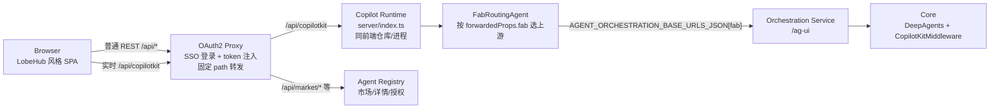

# AgentDock Web

AgentDock 是公司内部使用的 Agent 前端工作台：复用 LobeHub 打磨过的 UI/UX，对接公司后端能力（Agent Registry、Orchestration Service、Copilot Runtime），当前阶段只交付 Web 前端，所有数据通过前端 Service 层提供（默认返回 Mock Data）。

> 范围基线见 [docs/agentdock/00-project-baseline.md](docs/agentdock/00-project-baseline.md)；接口契约以 [04-frontend-backend-api.md](docs/agentdock/04-frontend-backend-api.md) 为唯一权威。

## 当前功能

- 单 Agent 对话：流式文本、Reasoning、Tool Call、HITL 暂停/继续、A2UI Surface、停止与错误展示。
- 会话历史：IndexedDB（Dexie）本地保存会话、可见消息和 Run 检查点，刷新可回看、HITL 可恢复。
- 市场：Agent / Skill / MCP 三类市场，**FAB 前置**（`getFabOptions` → 分类/列表/详情），支持 `all / permissioned` 两种模式；列表提供排序（sortBy 下拉 + 升降序切换），Agent 卡片展示 skill/mcp 数量，分页（antd Pagination）位于列表右下角。
- Skill 创建与立即发布（Mock）。
- 本月模式：一键只显示本月需要的菜单与路由，其余占位模块不渲染、不触发请求。
- 左侧菜单栏：可拖拽调整宽度，支持一键折叠/展开（折叠状态持久化，折叠后内容区头部提供展开入口）。
- 国际化：支持 LobeHub 全部 18 种语言（全部提供本地化词典）；语言优先级为用户设置 → 浏览器语言。

## 技术栈

- React 19 + TypeScript（strict）+ Vite 8
- React Router 7（SPA 声明式路由）
- `@lobehub/ui` / antd / antd-style（`createStaticStyles` + `cssVar` 优先）
- Zustand（页面/UI 状态）、Dexie（IndexedDB）
- Node 内置 `node:test`（运行时 reducer/SSE 单元测试）

## 系统架构

### 生产拓扑（方案 A：官方 CopilotKit + Copilot Runtime）



### 组件职责

| 组件 | 职责 |
|---|---|
| Browser SPA | LobeHub 风格 UI；`CopilotKit Provider + useAgent + useCopilotKit`；事件投影为 LobeHub ViewModel；IndexedDB 本地历史 |
| OAuth2 Proxy | SSO 登录态注入；固定 path 转发（`/api/*` → Registry、`/api/copilotkit` → Runtime）；不具备按 FAB 动态路由能力 |
| Copilot Runtime（`server/index.ts`） | single-route envelope（`{method, params, body}`）；`FabRoutingAgent` 按 FAB 选择上游；A2UI Middleware；HITL bridge；认证透传；可选静态托管 |
| Agent Registry | Agent/Skill/MCP 市场、FAB 前置查询、授权与详情 |
| Orchestration Service | `/ag-ui`（AG-UI SSE）；沿用客户端 `runId`；按 FAB 部署 |
| Core | DeepAgents + `CopilotKitMiddleware`；`render_a2ui`、HITL interrupt、流式事件 |

### 实时链路（AG-UI / A2UI / 流式回显）

```text
浏览器
  → POST /api/copilotkit（single-route envelope）
  → Copilot Runtime
      └─ FabRoutingAgent.run(input) → HttpAgent → POST {fab}/ag-ui
  → Orchestration（ag-ui-langgraph + CopilotKitMiddleware + DeepAgents）
  → AG-UI SSE 事件流原样返回
  → Runtime 编码回 SSE → 前端 transport 解析
  → agent.subscribe 回调 → reduceRunEvent 投影（RuntimeRunState）
  → LobeHub 组件按 orderedBlocks 顺序渲染
```

- **AG-UI**：run/connect/stop/info 全走 single-route envelope；`RUN_STARTED / STEP_* / REASONING_* / TEXT_* / TOOL_CALL_* / ACTIVITY_* / STATE_* / MESSAGES_SNAPSHOT / RUN_FINISHED` 逐类投影到对应组件。
- **A2UI**：Runtime `a2ui` middleware 把 `render_a2ui` 流式参数转成 `a2ui-surface` activity（`createSurface → updateComponents → updateDataModel`）；前端 Provider `a2ui={{ catalog }}` + 官方 renderer 渲染 catalog 组件；action 以 `forwardedProps.a2uiAction.userAction` 回传。
- **HITL**：标准 `RUN_FINISHED(outcome=interrupt)` 与 legacy `on_interrupt` 双 wire 均投影为暂停块，approve/reject 回传 requestId。
- **信息粒度渲染（fully copy LobeHub）**：文本（Markdown）、Reasoning 折叠卡、Tool 参数/结果卡、Workflow 步骤、Task/Delegation Activity、HITL 审批、A2UI 组件、错误卡，全部按事件顺序渲染（`orderedBlocks`）。

### 前端动作与事件支持矩阵

| 动作 | 入口 | mock / direct（自研 SSE） | http + proxy（官方 CopilotKit） | 携带 ID |
|---|---|---|---|
| 发送消息 | ChatInput 发送 | `forwardedProps.action=run` | envelope `agent/run` | `sessionId / agentId / fab / threadId / runId` |
| 停止生成 | 输入框停止按钮 | `action=stop` + 本地 abort | `agent/stop` + 本地 CANCELLED 终态 | `threadId / runId / sessionId` |
| HITL 审批 | HITL 同意按钮 | `hitlResponse decision=approve` | `RunAgentInput.resume[] status=resolved` | `requestId / threadId / runId` |
| HITL 拒绝（取消） | HITL 拒绝按钮 | `hitlResponse decision=reject` → `RUN_ERROR(CANCELLED)` | `resume[] status=cancelled` | `requestId / threadId / runId` |
| A2UI Action | A2UI 组件点击 | `a2uiAction`（新 runId + parentRunId） | renderer bridge `forwardedProps.a2uiAction.userAction` | `surfaceId / actionName / context` |
| 断线重连 | 页面刷新 / 重新进入 | ✅ `restoreSession` + `resume(lastStreamId)` | ✅ `connectAgent` 携带 `action=resume` + `resume.lastStreamId`（后端需按游标过滤） | `sessionId / runId / threadId / lastStreamId` |

消费的 AG-UI 事件（`runReducer` 支持矩阵）：

| 事件 | 投影 | 组件 |
|---|---|---|
| `RUN_STARTED / RUN_FINISHED / RUN_ERROR` | status / error | ChatHeader Tag / ErrorBlock |
| `STEP_STARTED / STEP_FINISHED` | steps + orderedBlocks | WorkflowStepsBlock |
| `REASONING_MESSAGE_START / CONTENT / CHUNK / END` | reasoning | ReasoningBlock |
| `TEXT_MESSAGE_START / CONTENT / CHUNK / END` | messages | ChatItem + Markdown |
| `TOOL_CALL_START / ARGS / END / RESULT` | toolCalls | ToolCallBlock |
| `ACTIVITY_SNAPSHOT / ACTIVITY_DELTA` | activities / surfaces | HitlBlock / ActivityBlock / A2UI renderer |
| `STATE_SNAPSHOT / STATE_DELTA` | state | 诊断预留（P2） |
| `MESSAGES_SNAPSHOT` | messages 全量重建 | 恢复渲染 |
| `CUSTOM / RAW` | rawEvents | 不阻塞渲染 |

**断线重连现状（方向已冻结：按 streamId 游标恢复）**：mock / direct 路径 `restoreSession + resume(lastStreamId)`；http + proxy 路径刷新后恢复 UI/checkpoint、回填 `agent.setMessages`，并通过官方 `connectAgent` 携带 `action=resume` + `resume.lastStreamId` 请求游标后的缺失事件。两条路径都携带 `sessionId / runId / threadId / lastStreamId`；后端需按 `lastStreamId` 游标过滤（Redis TTL 与超时行为见 `design/07` §9）。

### 前端内部架构

```text
CopilotKit Agent（http+proxy 唯一状态源）
        │ agent.subscribe / useAgent
        ▼
useAgentDockConversation（投影 + 持久化 facade）
        ├─ RuntimeRunState（LobeHub ViewModel：messages/reasoning/toolCalls/steps/surfaces/activities）
        ├─ IndexedDB（sessionHistoryService v3：全量消息 + checkpoint）
        └─ mock 模式回退自研 SSE + runStore（direct 联调同理）
        ▼
ChatPage / MessageBlocks / Markdown / A2UI renderer（只读投影，纯展示）
```

对话历史：全部会话消息（单 Agent 与 Agent Group 的文本/reasoning/tool/activity/HITL/A2UI/step）保存在 IndexedDB（`agentdock-session-v3`），每次打开从本地恢复；清空浏览器存储后历史为空。

### ID 生成与管理（sessionId / threadId / runId / streamId）

| ID | 生成方式 | 管理位置 |
|---|---|---|
| `sessionId` | 路由 `/chat/:id`；会话主键 = 路由 id（默认入口固定 `session-inbox`，真实会话为 `crypto.randomUUID()`），`createSession({ id: sessionId })` 保证会话行与消息/checkpoint 同键 | Dexie `sessions.id`；ChatPage `session` state；消息/checkpoint 按 sessionId 查询 |
| `threadId` | 创建会话时 `crypto.randomUUID()` 固化进会话记录；hook 仅防御性兜底 `thread-${sessionId}` | Dexie `sessions.threadId`；同一会话所有 run 共用（DeepAgents 上下文线程） |
| `runId` | 每次发送 `crypto.randomUUID()`（mock 在 `createRunInput`，官方在 `send()`）；HITL 续跑沿用同一 run | Dexie `checkpoints.runId`（主键）+ `snapshot.runId`；后端必须原样回显，禁止二次生成 |
| `streamId` | 后端 SSE `id:` 或 `rawEvent.streamId`，前端 `parseSseStream` 提取 | 每个 run 的 `RuntimeRunState` 独立维护 `latestStreamId + processedStreamIds[]`（去重上限 5000）；checkpoint 落盘 `latestStreamId`；每条文本消息记录自己的 streamId（最后一次更新的游标，含 END） |

**会话列表刷新与会话标题**：

- 落库即广播：`createSession / updateSession / saveRunCheckpoint` 写库后派发 `agentdock:sessions-changed`，HomeSidebar / GroupSidebar / GroupHomePage 收到后重新拉取列表。
- 乐观插入：新建会话/群聊通过路由 `pendingSession` 立即插入侧边栏，不依赖 IndexedDB 写入与事件时序；focus / visibilitychange 变化时兜底刷新。
- 标题规则：创建时为“新对话/New chat”（群聊为“新建群聊/New group chat”），发送首条消息后用消息前 32 字符更新标题。
- 路由切换：`ensureSession` 仅在内存 session.id 与路由 id 一致时复用，避免把消息更新到上一个会话。
- 群聊返回主页：群侧边栏头部 Home 图标、群聊页头部返回按钮均可回到 `/chat/session-inbox`；群设置面板由头部信息图标开关。

**机制完备性说明**：

- `threadId`：✅ 创建会话时 UUID 固化、持久化、同一会话所有 run 复用；切换 agent/fab 是否新建 threadId 待与后端确认。
- `runId`：✅ 客户端生成、后端必须回显、checkpoint 持久化、HITL 与断线恢复沿用同一 runId；A2UI Action 官方路径暂不携带 `parentRunId`（官方 `runAgent` 参数不支持，mock 路径已带），如后端需要父子关联需在 `a2uiAction.userAction` 里显式传。
- `streamId`：✅ 每个 run 独立维护 `latestStreamId + processedStreamIds[]`、checkpoint 落盘、mock/direct 与官方路径均按 `lastStreamId` 游标恢复；待后端按游标过滤（方向已冻结）；同页多会话并发时防抖槽需按 sessionId 分槽（当前产品形态不触发）。

**streamId 维护的独立性**：

- 持久化层按 `runId` 主键 + `sessionId` 索引隔离，多个会话/run 的记录互不覆盖；多标签页各自独立，IndexedDB 同源共享但不冲突。
- 单标签页同一时刻只展示一个会话：mock 路径用全局 `runStore`（切换会话时以该会话 checkpoint 替换内存状态）；官方路径为每个会话注册独立代理 `agentdock-${sessionId}`，`httpRun` 是组件本地状态，切换会话时 `restore()` 重载对应 checkpoint。
- 已知边界：checkpoint 防抖槽是模块级单槽，未来若同页支持多会话并发运行，需改为按 sessionId 分槽（当前产品形态不触发）。

详细决策与实现见 [design/08](docs/agentdock/design/08-final-architecture-decision.md)、[design/09](docs/agentdock/design/09-agui-lobehub-rendering-adapter.md)、[design/10](docs/agentdock/design/10-end-to-end-code-review.md)。

## 快速开始

### 环境要求

- Node.js ≥ 22（测试依赖 `--experimental-strip-types`）
- pnpm ≥ 10

### 安装与启动

```bash
pnpm install
pnpm run dev
```

开发服务默认运行在 <http://127.0.0.1:5173>。

### 构建、预览与检查

```bash
pnpm run build      # tsc --noEmit + vite build，提交前必须通过
pnpm run preview    # 预览生产构建，默认 http://127.0.0.1:4173
pnpm run test       # 运行时单元测试（src/api/runtime/*.test.ts）
pnpm run typecheck  # 仅类型检查
```

### 启动 Copilot Runtime（本地联调）

```bash
pnpm run server
# 可选环境变量：PORT、HOST、AGENT_ORCHESTRATION_BASE_URLS_JSON、AGENTDOCK_DIST_DIR
```

## 配置

复制 `.env.example` 为 `.env` 后按需修改：

| 变量 | 默认值 | 说明 |
|---|---|---|
| `VITE_SERVICE_MODE` | `mock` | `mock` 使用内置 Mock 数据；`http` 走真实后端接口 |
| `VITE_CHAT_MODE` | 回退到 `VITE_SERVICE_MODE` | 对话运行时单独开关：`http` 走真实 AG-UI（Copilot Runtime）；`mock` 用内置 SSE。可与市场模式分开配置（如市场 mock、对话 http） |
| `VITE_API_BASE_URL` | `/api` | 普通业务 API 的 Base URL（同源代理） |
| `VITE_AGENT_RUNTIME_TRANSPORT` | `proxy` | `proxy` 固定走 `/api/copilotkit`；`direct` 为本地联调直连 FAB `/ag-ui` |
| `VITE_AGENT_ORCHESTRATION_ENDPOINTS_JSON` | `{}` | 仅 `direct` 模式使用：FAB → Orchestration Base URL 映射 |

生产默认拓扑见上方「系统架构」：浏览器只访问同源 `/api/*`；SSO 与固定 path 转发由 OAuth2 Proxy 负责；FAB 地址通过服务端环境变量 `AGENT_ORCHESTRATION_BASE_URLS_JSON` 注入，不写入前端构建产物；仓库不自建反向代理。

## 目录结构

```text
src/
├── app/          # 应用装配层：App.tsx / router.tsx / providers.tsx
├── api/          # 数据访问层：按领域拆分的 Service + core 契约 + runtimeConfig
├── components/   # 全局共享 UI：AppShell + shell（LobeHub 布局原语）
├── features/     # 业务域：chat / market / skill / workspace
├── i18n/         # 国际化（locales + dictionaries）
├── lib/          # 基础设施：httpClient（fetch 封装）、mock 工具
├── mock-data/    # 与 api/ 一一对应的 Mock 数据
├── stores/       # Zustand：runStore / uiStore
├── types/        # 全局共享领域类型
└── main.tsx      # 薄入口
```

结构规范与迁移规则详见 [docs/agentdock/06-frontend-migration-todo.md](docs/agentdock/06-frontend-migration-todo.md)。

## 主要路由

| 路径 | 页面 |
|---|---|
| `/chat/:id` | 对话页（默认跳转 `/chat/session-inbox`） |
| `/market/agent`、`/market/skill`、`/market/mcp` | 三类市场列表 |
| `/market/agent/:id`、`/market/skill/:id`、`/market/mcp/:id` | 三类详情 |
| `/market/skill/create` | Skill 创建 |
| `/group/*`、`/tasks/*`、`/documents/*`、`/memory/*`、`/channel/*`、`/artifact/*`、`/page/*`、`/settings/*` | 本月模式下的隐藏模块/占位页 |

## 文档索引

- [docs/README.md](docs/README.md)：全部文档入口与阅读顺序
- [docs/agentdock/design/00-design-index.md](docs/agentdock/design/00-design-index.md)：详细设计 / Review 结论 / 实现方案（索引）
- [docs/agentdock/design/01-end-to-end-runtime-link.md](docs/agentdock/design/01-end-to-end-runtime-link.md)：AgentDock ↔ Registry ↔ Runtime ↔ Orchestration 端到端链路
- [docs/agentdock/design/06-copilotkit-integration-plan.md](docs/agentdock/design/06-copilotkit-integration-plan.md)：CopilotKit 接入方案
- [docs/agentdock/design/07-end-to-end-debugging-guide.md](docs/agentdock/design/07-end-to-end-debugging-guide.md)：公司内联调与事件消费回显调试指南
- [docs/agentdock/design/08-final-architecture-decision.md](docs/agentdock/design/08-final-architecture-decision.md)：最终架构决策（CopilotKit × LobeHub × OAuth2 Proxy）
- [docs/agentdock/design/09-agui-lobehub-rendering-adapter.md](docs/agentdock/design/09-agui-lobehub-rendering-adapter.md)：AG-UI/A2UI → LobeHub 渲染投影层方案
- [docs/agentdock/design/10-end-to-end-code-review.md](docs/agentdock/design/10-end-to-end-code-review.md)：端到端逐行 Code Review（AG-UI/A2UI/流式回显/信息粒度渲染）
- [AGENTS.md](AGENTS.md)：AI Coding Agent 开发规范
- [DESIGN.md](DESIGN.md) / [DESIGN.dark.md](DESIGN.dark.md)：LobeHub 设计价值参考
- [task.md](task.md)：当前进度与验证记录

## 与 LobeHub 的关系

- UI/UX 从 `/private/tmp/lobehub-canary` 迁移，页面与源码映射见 [docs/agentdock/05-lobehub-source-migration.md](docs/agentdock/05-lobehub-source-migration.md)。
- 只迁移前端：不引入 LobeHub 后端、TRPC、数据库、Cloud 能力；页面只能依赖 Service interface，禁止直接 `fetch` 或直接导入 Mock Data。
