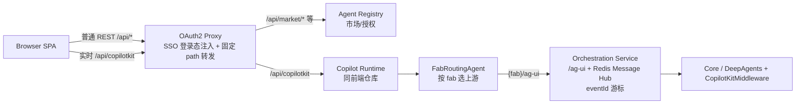

# 公司内接入真实 Orchestration Service 指南（核心链路 / 关键代码 / 协议约定 / 坑）

> 日期：2026-08-20
> 定位：把 AgentDock 联调中验证过的“Browser → Copilot Runtime → Orchestration(/ag-ui) → Core”链路，固化为接入公司真实 Orchestration Service 的工程指南。
> 前置阅读：`02-agui-a2ui-runtime-contract.md`、`08-final-architecture-decision.md`、`11-e2e-joint-test-report.md`

## 1. 角色划分

| 角色 | 职责 | 本仓库实现 |
|---|---|---|
| Browser | CopilotKit Provider + `useAgent`，提交 runId/threadId/fab，渲染 AG-UI 事件 | `src/app/providers.tsx`、`useAgentDockConversation.ts`、`runReducer.ts` |
| Copilot Runtime | single-route envelope、A2UI 注入、按 fab 路由、SSE 回传 | `server/index.ts` |
| Orchestration Adapter | `FabRoutingAgent`：按 `AGENT_ORCHESTRATION_BASE_URLS_JSON[fab]` → `{base}/ag-ui` | `server/copilot-runtime/fabRoutingAgent.ts` |
| Orchestration Service | 校验、沿用 runId、SSE 输出、eventId 游标（真实服务需 Redis Message Hub） | demo：FastAPI `/ag-ui` |
| Core | DeepAgents + CopilotKitMiddleware，动态 `generate_a2ui`、执行 agent | demo：`backend/agent.py`、`backend/main.py` |

## 2. 核心链路

### 2.1 本地联调链路（已实测打通）

```mermaid
flowchart LR
  B["Browser / AgentDock SPA<br/>CopilotKit Provider + useAgent"]
  R["Copilot Runtime / server/index.ts<br/>single-route POST /api/copilotkit"]
  F["FabRoutingAgent<br/>@ag-ui/client HttpAgent"]
  O["Orchestration Service /ag-ui<br/>AG-UI over SSE（demo: FastAPI 8123）"]
  C["Core / DeepAgents + CopilotKitMiddleware<br/>动态 generate_a2ui"]
  M["Model / DeepSeek v4 flash<br/>Responses API"]
  B -->|"envelope {method:agent/run, params, body:RunAgentInput}"| R
  R -->|"运行时 A2UI 注入 render_a2ui + catalog"| F
  F -->|"AGENT_ORCHESTRATION_BASE_URLS_JSON[fab] + /ag-ui"| O
  O --> C
  C -->|"工具/模型调用"| M
  M -.->|"流式输出"| C
  C -.->|"AG-UI 事件"| O
  O -.->|"SSE relay"| F
  F -.->|"Observable"| R
  R -.->|"SSE"| B
```



### 2.2 公司内生产拓扑（含 SSO 与 Registry）



接入真实服务时，只需把 `AGENT_ORCHESTRATION_BASE_URLS_JSON` 的 value 指向公司 Orchestration Service 的 base URL（`/ag-ui` 后缀由 Adapter 自动拼接），前端与 Runtime 无需改动。

## 3. 关键代码

### 3.1 Runtime 注册（server/index.ts）

```ts
const runtime = new CopilotRuntime({
  agents: {
    orchestration: new FabRoutingAgent({ fabToBaseUrl: parseFabEndpoints() }),
  },
  // A2UI 注入必须显式开启：middleware 负责加 render_a2ui + forwardedProps.injectA2UITool + catalog
  a2ui: { injectA2UITool: true },
});
```

### 3.2 Orchestration Adapter（fabRoutingAgent.ts）

```ts
override run(input: RunAgentInput): Observable<BaseEvent> {
  const fab = String((input.forwardedProps ?? {}).fab ?? '');
  const baseUrl = this.config.fabToBaseUrl[fab];
  if (!baseUrl) throw new Error(`FAB_ENDPOINT_NOT_CONFIGURED: ${fab}`);
  const upstream = new HttpAgent({
    url: `${baseUrl.replace(/\/+$/, '')}${this.config.path ?? '/ag-ui'}`,
  });
  // 幂等守卫：同一 threadId:runId 的 action=run 在途时返回 RUN_ERROR，避免重复执行
  return upstream.run(input).pipe(finalize(() => inFlightRuns.delete(key)));
}
```

### 3.3 Core 接入（demo 后端）

```python
# backend/main.py
add_langgraph_fastapi_endpoint(app=app, agent=LangGraphAGUIAgent(
    name="demo_agent", graph=agent,
), path="/ag-ui")

# backend/agent.py
model = ChatOpenAI(
    model=os.getenv("OPENAI_MODEL", "gpt-4.1"),
    use_responses_api=os.getenv("OPENAI_USE_RESPONSES_API", "false").lower() == "true",
    model_kwargs={"reasoning": {"effort": os.getenv("OPENAI_REASONING_EFFORT", "none")}},
)
agent = create_deep_agent(
    name="demo_agent", model=model, tools=[],
    middleware=[CopilotKitMiddleware(), FinalToolListLoggingMiddleware()],
    state_schema=AGUIDeepAgentState, checkpointer=MemorySaver(),
)
```

### 3.4 前端官方路径（useAgentDockConversation.ts）

```ts
const { agent, isReady } = useAgent({
  agentId: `agentdock-${sessionId}`,
  runtimeAgentId: 'orchestration',   // 对应 Runtime 注册的 agent
  threadId,
});
await copilotkit.runAgent({
  agent,
  forwardedProps: { action: 'run', agentId, fab, group, sessionId },
  runId,
});
```

## 4. 期望 payload 约定（Browser → Orchestration）

### 4.1 single-route envelope（Browser → Runtime）

```json
{
  "method": "agent/run",
  "params": { "agentId": "orchestration", "threadId": "thread-001" },
  "body": { "…RunAgentInput…" }
}
```

### 4.2 RunAgentInput（Runtime → Orchestration `/ag-ui`，标准 AG-UI）

```json
{
  "threadId": "thread-001",
  "runId": "9f338642-e569-42e1-8f91-a3e5fe22fc54",
  "state": {},
  "messages": [{ "id": "message-user-001", "role": "user", "content": "请分析今天的飞行测试数据" }],
  "tools": [],
  "context": [],
  "forwardedProps": {
    "action": "run",
    "sessionId": "session-001",
    "agentId": "flight-analysis-agent",
    "fab": "F15B",
    "group": { "members": [], "orchestrationMode": "supervisor" },
    "resume": { "lastEventId": "1723870000000-0" },
    "hitlResponse": { "requestId": "hitl-001", "mode": "toolAuthorization", "decision": "approve" },
    "a2uiAction": { "surfaceId": "surface-001", "sourceComponentId": "approve-button", "actionName": "approve_plan" }
  }
}
```

约束：
- `runId` 由客户端生成，Service/Core 必须原样沿用并在 `RUN_STARTED/RUN_FINISHED` 回显；同一 runId 的重复 run 不得重复启动 Core（Runtime 自带 Thread-already-running + FabRoutingAgent 幂等守卫双保险）。
- `fab` 必填；`agentId` 单 Agent 必填、Group 时用 `group`。
- 消息 role 只使用 `user/assistant`；system/上下文（A2UI catalog App Context）不要作为可见消息回传。

## 5. 期望 response 约定（Orchestration → Browser）

### 5.1 传输

`Content-Type: text/event-stream`，每个 SSE frame 的 `data:` 是一个完整 JSON BaseEvent；心跳用 SSE 注释 `: heartbeat`。

### 5.2 事件矩阵

| 事件 | 用途 | 关键字段 |
|---|---|---|
| `RUN_STARTED` / `RUN_FINISHED` | 生命周期 | `threadId/runId`；FINISHED 带 `outcome`（interrupt 时为 HITL） |
| `STEP_STARTED/FINISHED` | 工作流步骤 | `stepName/stepId/status/error` |
| `REASONING_MESSAGE_START/CONTENT/END` | Thinking | `messageId/delta`（DeepSeek reasoning 加密，当前无此事件，见坑 8） |
| `TEXT_MESSAGE_START/CONTENT/END` | 文本流 | `messageId/delta/role` |
| `TOOL_CALL_START/ARGS/END/RESULT` | 工具 | `toolCallId/toolCallName/delta/content` |
| `ACTIVITY_SNAPSHOT/DELTA` | HITL / A2UI surface / 业务活动 | `activityType/content`；A2UI 用 `a2ui-surface` + `a2ui_operations` |
| `STATE_SNAPSHOT/DELTA` | 状态 | `snapshot/delta(RFC6902)` |
| `MESSAGES_SNAPSHOT` | 会话权威顺序 | `messages[]`（只含 user/assistant，且不要带 `lc_run--*` 内部 id） |
| `RAW` | LangChain 透传追踪 | 前端不阻塞渲染 |
| `RUN_ERROR` | 失败 | `code/message` |

### 5.3 eventId / 断线恢复

- Service 在 `rawEvent.eventId` 与 SSE `id:` 提供游标（如 `1723870000000-0`）。
- **真实服务必须按 `lastEventId` 过滤回放**；在服务支持前，前端不会自动 resume（陈旧 running 快照转 cancelled），避免重放并发。

### 5.4 错误码

`INVALID_REQUEST / UNAUTHORIZED / AGENT_NOT_FOUND / AGENT_PERMISSION_DENIED / RUN_ALREADY_EXISTS / RUN_NOT_FOUND / STREAM_EXPIRED / CANCELLED / HITL_TIMEOUT / A2UI_INVALID_PAYLOAD / INTERNAL_ERROR / FAB_DUPLICATE_RUN`（Runtime 幂等拒绝）。

## 6. 接入真实服务验证清单

1. `AGENT_ORCHESTRATION_BASE_URLS_JSON={"F15B":"https://公司服务"}` 后 `curl /api/copilotkit`（info + agent/run）能拿到 RUN_STARTED→…→RUN_FINISHED。
2. `forwardedProps.fab/sessionId/runId/threadId` 全量到达 Service 日志，runId 未被二次生成。
3. 文本流逐段到达；`TEXT_MESSAGE_END` 后消息状态完成；历史刷新后仍在（依赖 `agentdock:run-persisted` 事件）。
4. Tool Call / Reasoning / HITL / A2UI 事件形状与 §5.2 一致（HITL wire 需公司后端真实样本冻结）。
5. 断线重连：Service 按 eventId 只补缺失事件；未支持前前端自动转 cancelled，不重放。
6. 并发：同一 runId 重复请求被拒（FAB_DUPLICATE_RUN 或 Thread already running），Core 不重复执行。

## 6.1 断线重连（eventId 游标）实测

demo 后端已实现 `backend/streaming.py`：

- 每个事件注入 `rawEvent.eventId`（`{epoch_ms}-{seq}`，同一 run 严格递增）；
- 事件按 runId 内存缓冲（上限 100 run，FIFO）；
- `forwardedProps.action="resume"` + `resume.lastEventId` 时只回放游标之后事件，**不重新执行 Core**；未知 run 返回 `RUN_ERROR(STREAM_EXPIRED)`。

实测结果（直连后端）：

```text
首轮：69 个事件均带 eventId
resume(lastEventId=第40条)：精确回放第 41~69 条（29 条），无模型调用
未知 runId：{"type":"RUN_ERROR","code":"STREAM_EXPIRED"}
```

⚠️ 通过 CopilotKit single-route `agent/run` envelope 走 resume 时，runtime 的 SSE 校验要求流首事件为 `RUN_STARTED` 且以终态结束，纯尾回放会被判 `INCOMPLETE_STREAM`。真实公司接入二选一：

1. 使用官方 `agent/connect`（带 `lastSeenEventId`）语义，由 Orchestration Service 回放完整可校验流；
2. 或回放从 `RUN_STARTED` 开始的完整事件（相同 eventId），客户端按 eventId 去重（前端 reducer 已支持）。

## 6.2 真实 HITL 实测（非 mock）

demo 后端启用 `interrupt_on={"write_file": True}`（deepagents 原生 HITL），并做了两层适配：

1. `ag_ui-langgraph 0.0.40` 把 langgraph interrupt 暴露为 `CUSTOM(name=on_interrupt, value=<HITLRequest JSON>)` 且**不含 id**；`backend/streaming.py` 从 checkpointer（`tasks[].interrupts`）读出真实 interrupt id 注入 value，并补 `message`。
2. 前端 legacy HITL wire 增强：`respondToHitl` 在有 legacy interruptId 时走 `runAgent({ resume: [{ interruptId, status, payload: { decisions: [{type:'approve'|'reject'}] } }] })`，并携带原 forwardedProps（fab/sessionId）。

实测结果：

```text
✅ write_file 触发真实 langgraph interrupt
✅ 页面渲染 HitlBlock（需要你的确认 / 允许并继续 / 拒绝）
✅ 批准请求携带真实 interruptId + decisions payload 到达后端
✅ 纯 deepagents 层 resume 后工具执行成功（ToolMessage: Updated file）
⚠️ 通过 ag_ui-langgraph 0.0.40 的 HTTP resume 映射仍会重新 interrupt（适配层
   把 ResumeEntry 列表原样传给 Command(resume=...)，与 langchain HITL 的
   interrupt() 返回值约定不兼容；demo 已做解包但仍未完全打通）。
```

结论：真实 HITL 的“事件样本 + 页面渲染 + 用户确认请求”链路已冻结；**续跑执行需要公司 Orchestration Service 实现正确的 resume 映射，或升级 ag_ui-langgraph**（即 `02-agui-a2ui-runtime-contract.md` §8.2/§14 的“真实 HITL fixture 待冻结”项）。

## 7. 已踩的坑（务必阅读）

1. **前端 A2UI catalog 组件名必须对齐后端生成器**：后端按 a2ui.org v0.9 生成 `Metric/Title/Card/Column/Row`，`@copilotkit/a2ui-renderer` 的 web_core basic catalog 只有 `Text/Row/Column/Card/…`，缺 Metric/Title → 页面渲染 “Unknown component: Metric”。前端 catalog 已补齐同名定义（`a2ui/catalog.tsx`）。
2. **`renderActivityMessage` 的 content 受 Zod 校验**：只能含 `a2ui_operations`，附加 `surfaceId` 等字段会静默返回 null。
3. **不要自包 `@copilotkit/a2ui-renderer` 的 A2UIProvider**：react-core 自带同一包 context，直接复用 `useRenderActivityMessage`；自包会出现 context 缺失或组件名解析不一致。
4. **`lc_run--<langgraph run id>` 双 id**：流式 TEXT 事件用 `lc_run--` 作 messageId，快照用规范 UUID；前端以快照为准替换占位，且占位不落库。
5. **system 上下文不得当消息渲染**：runtime 注入的 “App Context”（A2UI catalog）是 system 消息，`MESSAGES_SNAPSHOT` 会原样带回；前端只投影 user/assistant。
6. **历史刷新与落库竞态**：终态 `flushRunCheckpoint` 是异步的，页面不能立刻读历史；落库完成后广播 `agentdock:run-persisted` 再刷新。
7. **没有 eventId 游标前禁止自动 resume**：`connectAgent(action=resume)` 会重放整轮对话并造成并发 run；HITL 续跑走 `runAgent(resume[])`。
8. **DeepSeek thinking 与 forced tool_choice 互斥**：`reasoning=high` 时 A2UI secondary 的 forced `render_a2ui` 返回 400，当前用 `OPENAI_REASONING_EFFORT=none` 换取 A2UI；主/副模型分离后可恢复推理。
9. **DeepSeek reasoning 是加密内容**：ag_ui-langgraph 0.0.40 不产生 `REASONING_MESSAGE_*` 事件，Thinking 组件只能 mock 验证。
10. **A2UI 多轮上下文 secondary 可能偏离**：同 thread 历史包含大量工具调用时，secondary 可能不按 forced render_a2ui 走；新会话单轮稳定。
11. **VITE_CHAT_MODE 与 VITE_SERVICE_MODE 必须分开**：一个开关同时管市场与对话会导致构建环境差异时页面静默回退 mock；`agent-dock/.env` 已锁定 `VITE_CHAT_MODE=http` + `VITE_SERVICE_MODE=mock`。
12. **并发 run 有三层防护**：前端 send 防重入 → Runtime `InMemoryAgentRunner`（Thread already running）→ FabRoutingAgent 幂等守卫；三层缺一不可（前端兜底 UX，Runtime 兜底并发）。
13. **`@lobehub/ui` 根包与 base-ui 导出集合不同**：迁移组件先 `rg` 确认导出；`Switch` 在 base-ui，`ContextMenu` 不存在（用 antd Dropdown）。
14. **客户端 SSE 偶发 network error**：后端已完成但浏览器流被中断（工具类 run 偶发）；前端已做 runAgent 异常兜底（终态不覆盖、非终态写 RUN_ERROR），内容保留、UI 不卡死。
15. **resume 与 runtime SSE 校验**：纯尾回放会被 CopilotKit 判 INCOMPLETE_STREAM（首事件必须 RUN_STARTED）；真实接入用 `agent/connect` 或全量回放+eventId 去重。
16. **真实 HITL 的 wire 差异**：ag_ui-langgraph 0.0.40 用 legacy `CUSTOM on_interrupt`（value 是 HITLRequest JSON 且无 id），且其 HTTP resume 映射与 langchain `interrupt()` 返回值约定不兼容；demo 已做 id 注入/解包适配，续跑执行需公司服务层实现或升级适配器。
