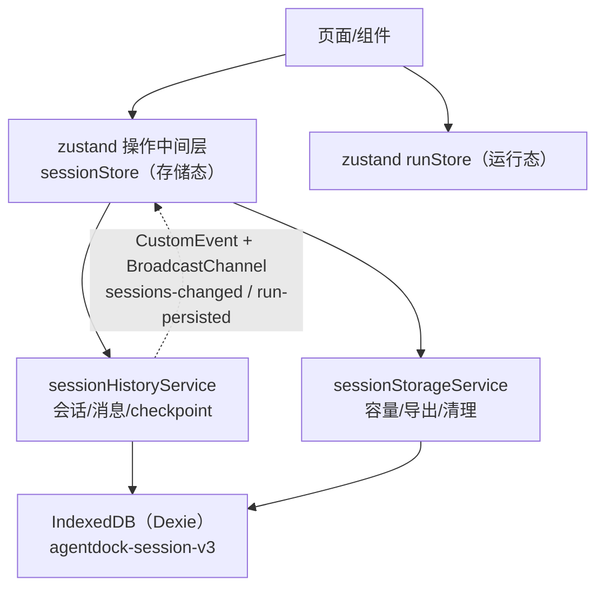
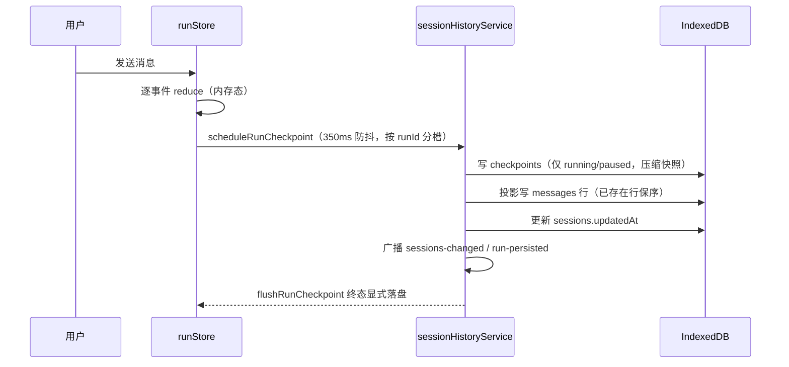
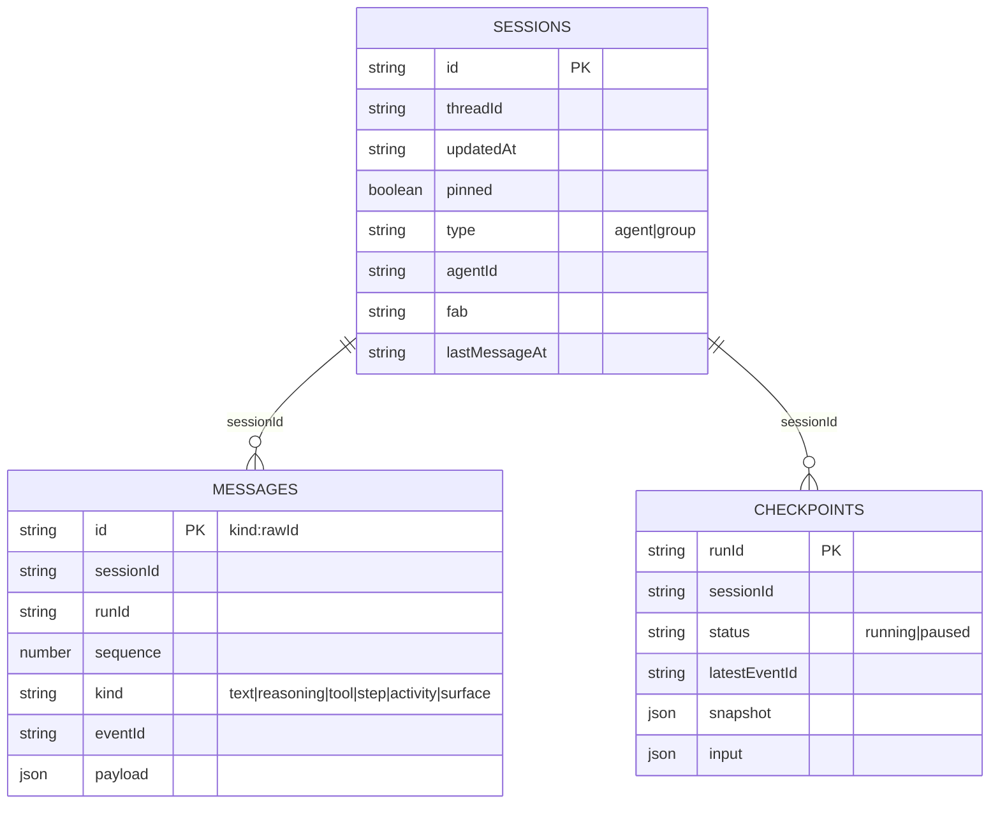
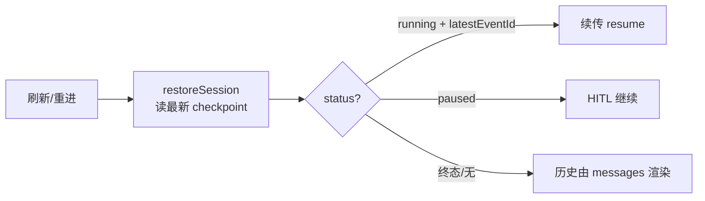

# AgentDock Chat 本地 IndexedDB 存储：架构、机制与实现详解

> 本文从机制与架构视角讲透 AgentDock 的本地聊天存储：为什么这样设计、每个机制解决什么问题、如何工作、边界与取舍。代码层面的落点见第 18 章文件索引，本文不展开代码。
> 状态：已实现并全量验证（typecheck / 45 项测试 / build / headless 冒烟）。

---

## 目录

1. 背景与目标
2. 技术选型与决策依据
3. 总体架构
4. 数据模型设计
5. 写入机制：防抖与落盘
6. 一致性机制
7. Checkpoint 生命周期机制
8. 断线续传机制（eventId 全链路）
9. 分页与懒加载机制
10. 容量管理与用户清理机制
11. 迁移机制
12. 跨页面同步机制
13. 错误处理与可观测机制
14. 操作中间层机制（zustand）
15. 与 LobeHub 的架构对比
16. 权衡与取舍
17. 测试与验证策略
18. 关键文件索引

---

## 1. 背景与目标

AgentDock 是纯本地优先的 Agent 对话前端：会话历史只保存在当前浏览器 IndexedDB，不上传后端。存储系统要支撑的第一性目标是：

> **用户进入任意会话，能完整看到该会话的历史消息记录（文本、推理、工具调用、步骤、活动、A2UI 面板）。**

围绕这个目标派生出六个工程目标：

1. **完整性**：历史不丢、顺序不乱、编辑/删除/分支替换后不“复活”。
2. **容量可感知、可回收**：长期使用不把浏览器存储打满；满了有预警，用户能主动导出并清理。
3. **海量可用**：会话上千、单会话消息上万时，列表与消息都按需加载，不一次全量读。
4. **断线可续**：页面刷新/网络中断后，进行中的 run 能恢复（或安全降级），不产生并发重放。
5. **跨标签页一致**：多标签页同开时，一边删除/新建，另一边实时刷新。
6. **可升级不丢数据**：schema 演进走版本化迁移，旧数据自动回填。

所有设计决策都可以回溯到这几个目标：凡是不为“看到历史”服务的数据，一律不存或少存；凡是影响完整性的机制，宁可保守。

---

## 2. 技术选型与决策依据

### 2.1 为什么用 IndexedDB 而不是 localStorage

| 维度 | IndexedDB | localStorage |
|---|---|---|
| 容量 | 数百 MB ~ 无上限（origin 配额） | 5 MB 左右 |
| 数据形态 | 结构化记录 + 多列索引 | 单字符串键值 |
| 查询 | 索引范围查询、复合索引、游标 | 全量 JSON 解析后内存过滤 |
| 写入 | 事务、异步、批量 | 同步全量覆写 |
| 适用 | 长历史、过程块、大 payload | 偏好类小数据 |

结论：聊天历史天然是“大、结构化、按会话/按时间查询”的数据，localStorage 全量读写会在消息上千后卡死并爆配额。

### 2.2 为什么用 Dexie 而不是原生 IndexedDB 或 forceStorage

- **原生 IndexedDB**：API 底层、样板多、无类型；迁移、复合索引、批量、事务组合都要手写，容易出错。
- **forceStorage（localStorage 全量兜底）**：本质上还是“整库序列化”，没有索引与增量，与本地存储目标相悖。
- **Dexie**：在原生之上提供声明式 schema 与版本迁移（`version(n).stores().upgrade()`）、类型化表、链式查询（索引范围/复合/游标）、事务与批量 API。它是“机制”而不是“兜底”：把精力放在数据模型与一致性上，而不是 IDB 细节。

### 2.3 为什么加 zustand 操作中间层

存储操作横跨多个页面（首页、侧栏、设置、对话页），如果每个页面各自直调 service 并挂监听，状态会散、跨页刷新会漏。用 zustand 做**操作中间层**：状态单一来源、action 统一收敛、模块级订阅跨页变更，页面只消费 store。

### 2.4 为什么用 BroadcastChannel 做跨标签页

`window` CustomEvent 只在当前窗口内传播；Dexie 的 liveQuery 面向单标签页响应式查询，不解决“另一个标签页写库后本页刷新”的问题。BroadcastChannel 是浏览器原生、同源多标签页广播的最轻机制，与 CustomEvent 组成“双通道”。

---

## 3. 总体架构

### 3.1 分层模型

### 3.2 职责边界

| 层 | 职责 | 不做什么 |
|---|---|---|
| 存储服务（history） | 会话/消息/checkpoint 的 CRUD、防抖落盘、分页、迁移、跨页订阅 | 不持有 UI 状态、不做容量决策 |
| 存储服务（storage） | 容量估算与预警、清理候选选择、导出、级联删除 | 不直接读写会话业务 |
| sessionStore | 会话列表窗口、容量状态、清理预览、导出/删除 action、跨页自动刷新 | 不碰流式运行 |
| runStore | 流式事件消费、run 状态、断线续传执行 | 不直接落库（通过 service） |
| 页面 | 渲染与交互，消费 store | 不再直调 Dexie、不再各自挂监听 |

### 3.3 一次完整的数据流

---

## 4. 数据模型设计

### 4.1 实体关系

### 4.2 三张表的职责

| 表 | 权威角色 | 说明 |
|---|---|---|
| `sessions` | 会话目录 | 列表、聚合、清理语义（lastMessageAt） |
| `messages` | **历史唯一权威** | 用户能看到的一切，都由这里渲染 |
| `checkpoints` | 运行恢复 | 只保留 running/paused，用于断线续传与 HITL |

### 4.3 主键设计

- **sessions.id**：业务 UUID（`crypto.randomUUID()`），可被路由直接引用。
- **messages.id**：`kind:rawId` 复合键（如 `text:uuid`、`tool:uuid`）。同一 rawId 的不同视角（文本、工具、推理）互不覆盖，编辑/删除可按前缀定位；rawId 从协议消息 id 直接派生，天然幂等。
- **checkpoints.runId**：每次发送生成一个 runId，HITL 续跑沿用，天然唯一。

### 4.4 索引设计（每个索引解决一个查询）

| 索引 | 支撑的查询/机制 |
|---|---|
| `sessions.updatedAt` | 列表按最近活动倒序 + limit/offset 游标分页 |
| `sessions.type` | 群组列表聚合 |
| `sessions[agentId+fab]` | Agent Space 按身份聚合话题 |
| `sessions.lastMessageAt` | 清理语义（N 天前 / 最旧 N 个） |
| `messages.sessionId` | 按会话取历史、级联删除 |
| `messages.runId` | 整轮装载/删除（过程块随 run 打包） |
| `messages[sessionId+sequence]` | 会话内消息游标分页（首屏最近 N 条 + 加载更早） |
| `checkpoints.status/updatedAt` | 恢复：最新 running/paused |

### 4.5 关键字段语义

- **sequence**：会话内单调递增的排序号（时间戳 ×1000 + 递增种子，种子随机起步、不取模——同标签页内严格单调，消除同毫秒回绕；跨标签页同毫秒并发写同一会话的碰撞概率压到约 1/1000）。已存在行落库时**保留原 sequence**，这是“多轮时间线不乱”的基石。
- **runId**：一轮执行的唯一标识；过程块按 runId 归属到该轮助手文本。
- **eventId**：事件流游标；消息行冗余记录自己最后一次更新的游标（展示/调试），续传用 checkpoint 的 latestEventId。
- **lastMessageAt**：会话内最后一条**消息**的时间（非会话创建时间、非 updatedAt），是清理语义的唯一基准。

### 4.6 冗余与一致性取舍

- sessions 冗余 `agentId/fab/agentName`：列表与侧栏免 join，成本是会话归属变化时要同步——Agent 身份在会话生命周期内不变，可接受。
- messages 冗余 `eventId`：仅为展示/调试，不参与续传；是快照投影的自然产物。
- checkpoint 快照与 messages 行存在“双写”，但**messages 是权威**：checkpoint 只是运行态恢复的临时视图，终态即删，双写窗口有限。

---

## 5. 写入机制：防抖与落盘

### 5.1 问题

流式对话每秒产生大量 AG-UI 事件（文本增量、推理、工具、步骤、A2UI），每个事件都落库会拖垮 UI 并放大写放大。

### 5.2 机制：三层写入策略

1. **内存态**：事件先进 runReducer（内存 RuntimeRunState），页面渲染读内存，最快。
2. **防抖落盘**：`scheduleRunCheckpoint` 按 **runId 分槽**缓存最新快照，空闲 **350ms** 统一 flush。分槽解决“快速连续两轮 run 互不覆盖”；防抖解决“高频事件只落最终态”。
3. **终态显式 flush**：run 结束（success/cancelled/error）立即 flush，不依赖定时器。

另有**页面隐藏兜底**：`pagehide` / `visibilitychange=hidden` 时尽力 flush，减少“最后一轮丢失”窗口（best-effort，IndexedDB 在卸载期不保证可用）。

### 5.3 事务边界

一次落盘在单事务内完成：

- running/paused → 写 checkpoint（压缩快照 + 压缩 input）；
- 投影写 messages 行（读已有行 → 合并 → bulkPut）；
- 更新 sessions.updatedAt；
- 广播变更事件。

事务保证“checkpoint、消息、会话时间戳”要么一起成功要么一起失败，避免半落库。

### 5.4 快照投影（RuntimeRunState → messages 行）

运行时状态是“消息 map + 过程块 map + 顺序数组”，存储形态是“扁平行”。投影机制：

- 只持久化用户/助手文本与过程块；system/developer 上下文、流式占位 id（`lc_run--`）不落库，避免重复气泡与脏上下文。
- 已存在行按 `kind:rawId` 复用，**保留原 sequence/createdAt/runId**；新行按首次出现位置分配 sequence。
- 顺序以协议的权威顺序（messageOrder）为准，而不是 JS map 迭代序，杜绝多轮 flush 后时间线重排。

---

## 6. 一致性机制

### 6.1 顺序一致性

- **sequence 稳定**：一旦分配不再改动；重写快照只 upsert，不重排。
- **messageOrder 权威**：新消息按首次出现追加，多轮 MESSAGES_SNAPSHOT 累积时不覆盖旧顺序。

### 6.2 删除/编辑不“复活”

- **删除消息**：删文本行 + 其后随过程块 + 含该消息的 checkpoint，避免刷新后快照把已删消息“复活”。
- **分支替换（regenerate/编辑）**：按 runId 整轮删除（用户文本 + 回复 + 全部过程块 + checkpoint），再重跑——存储顺序是“文本在前、过程块在后”，不能按“下一条文本”切分，必须按 runId 打包。
- **编辑内容**：同步消息行与 running/paused checkpoint 快照。

### 6.3 删除后的派生状态

删除文本后重算 `lastMessageAt`（取剩余 text 行最大 createdAt，空会话回退 createdAt），保证清理语义不被删除操作污染。

### 6.4 幂等与去重

- 重放同一 eventId：`processedEventIds` 精确去重，reducer 直接返回旧状态，不重复拼接文本。
- 落库幂等：`kind:rawId` 主键 + bulkPut，同一行重复写是覆盖而非重复插入。

---

## 7. Checkpoint 生命周期机制

### 7.1 checkpoint 是什么、给谁用

checkpoint 是运行状态快照（完整 RuntimeRunState + 输入），只有两个消费方：

1. **刷新/断线恢复**：恢复 `input + snapshot`，running 且有 latestEventId 时按游标续跑；HITL paused 恢复同样依赖。
2. **运行态渲染**：刷新后 isActiveRun（running/paused）时渲染进行中的过程块。

### 7.2 为什么终态 checkpoint 不落库

对话页的 `isActiveRun` 只对 `running/paused` 为真；终态恢复后 run 不参与渲染——历史文本与全部过程块都由 messages 表渲染。**终态 checkpoint 对“看到历史”零贡献**，因此：

- 终态（success/cancelled/error）只写 messages + 更新会话时间戳，不写 checkpoint；
- `pruneCheckpoints` 删除会话内全部终态行；
- 启动时 `sweepTerminalCheckpoints` 全库清扫存量终态行（幂等，只动 checkpoints 表）。

### 7.3 内容压缩机制

对 running/paused 快照做最小化裁剪：

| 保留 | 理由 |
|---|---|
| messages / messageOrder / orderedBlocks | 渲染与续传必需 |
| reasoning / reasoningMeta / toolCalls / steps / activities / surfaces | 过程块渲染 |
| status / error / latestEventId / processedEventIds | 状态与续传去重 |

| 丢弃 | 理由 |
|---|---|
| rawEvents（完整事件日志） | UI 零消费，实测单 run 占快照 ~57%；reducer 从空数组继续追加 |
| state | 仅 STATE 事件时更新，恢复后 undefined 也正常 |
| input 的 context/state/tools | 续传只消费 forwardedProps + runId/threadId/messages |

实测：同一条 run 快照 44.8KB → 19.3KB（省 ~57%）。叠加“终态不落库”，checkpoints 表在正常会话里趋近于空。

### 7.4 存量回收

- **启动清扫**：删除全库终态 checkpoint（老用户数据下次打开自动瘦身）。
- **读取时惰性压缩**：读到 `rawEvents` 非空的旧格式行，压缩后重写回库，一次性回收。

### 7.5 上下文回填迁移

终态 checkpoint 曾是 http 路径回填下一轮对话上下文的来源；现在改为从 **messages 表重建** `agent.setMessages`——历史权威源不变，且不依赖 checkpoint 存在。

---

## 8. 断线续传机制（eventId 全链路）

### 8.1 存储

- checkpoint 保存 `latestEventId`（run 游标）+ `processedEventIds`（重放精确去重）+ 快照内每条消息的 eventId。
- messages 行冗余 eventId（展示/调试，不参与续传）。
- 压缩策略明确保留这三者，不会误删。

### 8.2 取用

- mock 路径：restoreSession 直接恢复 run 并续传。
- http 路径：**陈旧 running 自动转 cancelled**（后端无游标回放前不自动续传，防并发重放），历史照常渲染，下一轮上下文从 messages 表回填。

### 8.3 发送

`runStore.resume` 构造 `resume.lastEventId = run.latestEventId`，随 POST body 的 `forwardedProps` 发往后端；后端按 **`eventId > lastEventId` 字符串比较**回放游标之后的事件。

### 8.4 排序契约（关键约束）

eventId 必须**字符串可排序**（序号定宽补零，如 `{epoch_ms}-{seq:06d}`）。未补零时，run 超过 9 个事件后 `"-10" < "-9"`（字典序），resume 会漏事件。前端只做精确去重，不做大小比较——比较完全交给后端，因此排序格式是后端契约的一部分。

### 8.5 防重入

- 前端“陈旧 running 不自动 resume”：http 路径转 cancelled。
- 前端“同会话并发 run 门禁”：上一轮未结束（running/paused）时忽略新发送。
- 重放安全：`processedEventIds` 精确去重 + 后端按游标只补缺失事件。

---

## 9. 分页与懒加载机制

### 9.1 会话列表

- **游标分页**：`listSessions({ limit, offset })` 走 `updatedAt` 倒序索引，`countSessions()` 提供 hasMore。
- **窗口维护**：sessionStore 维护首屏 50 条窗口，`loadMoreSessions()` 每次 +50 并重取；跨页变更自动刷新当前窗口。
- **侧栏分工**：HomeSidebar 用全局窗口；Agent 话题 / 群组走**专用索引查询**（`[agentId+fab]` / type），各自加载更多——避免“窗口切掉某 Agent 的话题”这类错误。
- **搜索态**：浏览态用窗口；搜索态全量扫标题/Agent 名，不受窗口限制。

### 9.2 会话内消息

#### 为什么分页单位是“run”而不是“行”

messages 行里，助手文本与其过程块（reasoning/tool/step/activity/surface）按 runId 归属；存储顺序是“文本在前、过程块在后”。如果按行数分页，页边界可能切断一轮，导致块挂错消息或跨页重复。因此**每页以“最近 N 条文本所属的整轮”为单位**：

1. 用 `[sessionId+sequence]` 复合索引倒序扫描，取最近 N 条文本；
2. 收集这些文本的 runId 集合；
3. 按 runId 装载整轮全部行（文本 + 过程块），页内保证每轮完整；
4. 游标 = **页内全局最小 sequence（整轮的最旧行）**而非最旧文本——分页在轮中间截断时（如每轮 2 条文本、每页 7 条），最旧文本所在轮的用户文本早于该文本，若游标取最旧文本，下一页会把该轮剩余行再次纳入造成跨页重复；`hasMore` 用索引探测游标之前是否还有文本。

#### 变更后的窗口重取

删除/编辑/终态刷新时，不能简单“重新拉最新一页”丢掉用户已加载的更早内容；机制是按“当前已加载文本数”重取“最新 N 条文本窗口”，保留窗口内的更早部分，新消息自然并入。

#### 收益与边界

- 收益：进会话不再全量拉长历史；侧栏不再一次读全部 session；翻页只读页内数据。
- 边界：搜索仍全量扫（标题/Agent 名，量级可控）；超大 tool 结果仍在 payload 内（完整使用优先）。

---

## 10. 容量管理与用户清理机制

### 10.1 用量估算

- `navigator.storage.estimate()` 给出 **origin 级** usage/quota（浏览器 API 粒度，无法精确到本库）；
- 叠加本库三表 `count()` 行数，便于判断“是不是我们占的”。
- 百分比 <1% 按 1% 显示（避免 0% 误导）。

### 10.2 阈值与预警

- **分级阈值与颜色**：< 70% 健康（绿）/ 70–90% 需注意（橙）/ ≥ 90% 高危（红）；
- `checkStorageHealth` 10s 节流 + **跨级去重**（ok→warning/critical 只提示一次，降回 ok 后重置）；
- 触发时机：启动、落库后（节流）、回到前台、设置页手动刷新；
- 事件协议：`agentdock:storage-warning`（AppShell 弹可点击提示，设置页进度条 + 健康状态）。

### 10.6 容量 UI/UX（产品视角）

**三档状态机**（全局唯一口径）：

| 档位 | 阈值 | 颜色 | 文案 | 用户动作 |
|---|---|---|---|---|
| 健康 | < 70% | 绿 #52c41a | 本地存储使用正常 | 无需操作 |
| 需注意 | 70–90% | 橙 #faad14 | 本地存储已使用 X%，建议导出或清理旧会话 | 择期清理 |
| 高危 | ≥ 90% | 红 #ff4d4f | 存储即将耗尽，强烈建议立即导出并清理 | 尽快清理 |

**提醒触点（不止一次性 toast）**：

1. **常驻角标**：侧栏「设置」入口显示橙/红圆点，健康时无点——用户随时能看到“有事没处理”，不依赖弹窗时机。
2. **可点击 toast**：跨级触发一次，文案含占用百分比，**点击直达** `/settings?tab=storage`（深链）。
3. **设置页分级进度条**：进度条与健康标签同色（绿/橙/红），高危时红字横幅 + 「导出与清理」按钮平滑滚动到清理区。
4. **清理引导闭环**：清理后进度回绿，角标消失、toast 不再重复（跨级去重），用户获得即时正反馈。

**降级策略**：写入遇 QuotaExceededError → storage-error 提示“存储空间不足，请前往设置清理”，与预警共用同一出口。预警只提示、不自动删，避免误删。

### 10.3 用户主动清理

两种模式，语义统一为**“按最后一条消息时间”**（lastMessageAt，非创建时间）：

| 模式 | 语义 | 实现 |
|---|---|---|
| N 天前 | 最后消息早于 now − N 天 | `lastMessageAt` 索引 below(bound) |
| 最旧 N 个 | 按最后消息时间升序取前 N | 索引升序 + 缺字段按 updatedAt 兜底 |

- **预览**：候选列表（标题 + 最后消息时间 + 消息数 + 估算体积），内部滚动条。
- **导出**：JSON（app/exportType/version/exportedAt/criteria/sessions/messages/checkpoints），Blob 下载。
- **删除**：三表级联删除。
- **原子性保障**：**先导出、后删除**——导出失败不删数据；删除失败时已下载文件仍有效。
- 输入交互：天数/个数可清空自由输入（含 0），空值禁用操作，避免误触。

### 10.4 lastMessageAt 维护点

创建时=createdAt；落盘时取“现有行 + 本次写入”的 text 最大 createdAt；删除消息后重算；空会话回退 createdAt。任何清理语义都不会被陈旧字段污染。

### 10.5 写失败降级

落库抛 QuotaExceededError 等 → `agentdock:storage-error` → UI 提示“存储空间不足”，引导去设置页导出清理。预警只提示、不自动删，避免误删。

---

## 11. 迁移机制

### 11.1 原则

**追加不修改**：schema 演进只新增 version，不在旧版本上改；数据回填在 `upgrade` 事务内完成，保证原子。

### 11.2 迁移清单

| 版本 | 变更 | 回填逻辑 |
|---|---|---|
| v1 → v2 | sessions 增加 `agentId/fab/[agentId+fab]/createdAt/lastMessageAt` | 遍历 text 行算每会话最大 createdAt 回填；空会话回退 createdAt |
| v2 → v3 | messages 增加 `[sessionId+sequence]` 复合索引 | 纯索引迁移，无数据改写 |

### 11.3 多标签页升级

- `blocked`：另一标签页持有旧连接阻塞升级 → 提示用户关闭旧标签页刷新。
- `versionchange`：本标签页收到其他标签页升级信号 → 主动 close 释放连接，不反过来阻塞对方。

### 11.4 失败与回退

迁移在事务内，失败整体回滚；已存在数据不因迁移丢失。测试用 fake-indexeddb 覆盖 v1→v2 回填路径。

---

## 12. 跨页面同步机制

### 12.1 问题

同一个 origin 多标签页打开时，标签页 A 删除会话、标签页 B 侧栏必须实时更新；升级时还要避免互锁。

### 12.2 双通道事件协议

| 通道 | 事件 | 触发点 |
|---|---|---|
| 同窗口 CustomEvent | `sessions-changed` | 会话创建/更新/删除/消息落库 |
| 同窗口 CustomEvent | `run-persisted` | checkpoint 落库完成（对话页确定性刷新） |
| 跨标签页 BroadcastChannel | `agentdock:session-sync` | 同上两条，postMessage 镜像 |
| 窗口级 | `storage-warning` / `storage-error` / `indexeddb-blocked` | 容量/写失败/升级阻塞 |

### 12.3 订阅模型

`subscribeSessionChanges(cb)` 同时监听 CustomEvent 与 BroadcastChannel，返回退订函数；sessionStore 在模块级订阅一次，任何变更自动刷新会话列表与容量。页面不再各自挂 focus/visibilitychange 监听（store 统一处理）。

### 12.4 为什么不用 Dexie liveQuery

liveQuery 解决“单标签页内数据变化自动重渲染”，不解决“跨标签页写库后本页刷新”；本方案的事件协议同时覆盖同窗口与跨标签页，并附带“确定性时机”（run-persisted 在落库完成后广播，避免竞态）。

---

## 13. 错误处理与可观测机制

| 机制 | 触发 | 行为 |
|---|---|---|
| 写库守卫 | 任何落库异常 | 广播 storage-error 后原样抛出，调用方可降级 |
| 阻塞诊断 | 单次操作超 3s | 控制台告警“可能被旧标签页阻塞”，AppShell 提示 |
| 启动清扫 | 应用启动 | 幂等删除存量终态 checkpoint |
| 惰性压缩 | 读到旧格式 checkpoint | 压缩重写回库 |
| 容量预警 | 跨过 70%/90% | 事件 + AppShell 提示 + 设置页展示 |

整体思路：**能自愈的自愈（清扫/压缩），不能自愈的上报（错误/预警），上报后给用户明确出口（设置页清理）。**

---

## 14. 操作中间层机制（zustand）

### 14.1 为什么需要

存储操作横跨首页、侧栏、设置、对话页；直调 service + 各自挂监听会导致：监听重复、状态不同步、跨页刷新漏掉。中间层把“状态 + 变更订阅 + 操作”收敛为一处。

### 14.2 状态与 action 划分

| 状态 | 说明 |
|---|---|
| sessions / hasMoreSessions / sessionLimit | 列表分页窗口 |
| storageUsage | 容量估算与健康状态 |
| cleanupSelection / busy | 清理预览与操作中标志 |

| action | 说明 |
|---|---|
| refreshSessions / loadMoreSessions | 列表窗口维护 |
| refreshStorageUsage | 容量刷新 + 节流预警 |
| previewCleanup / exportCleanup / exportAndDeleteCleanup | 清理三件套 |
| removeSession / resetCleanup | 删除与重置 |

### 14.3 运行态与存储态职责分离

- **runStore**：只管内存运行态与续传执行；
- **sessionStore**：只管持久化与容量；
- 交叉点（落盘、恢复）通过 service 收敛，不在页面里拼装。

---

## 15. 与 LobeHub 的架构对比

| 维度 | 经典 LobeChat（Dexie） | AgentDock |
|---|---|---|
| schema 演进 | version(1..11) + upgrade 回填 | version(1..3) + upgrade 回填 |
| 写入校验 | zod safeParse | TS 类型约束（zod 列为演进项） |
| 复合索引 | `[sessionId+topicId]` | `[agentId+fab]`、`[sessionId+sequence]` |
| 消息分支 | parentId | runId 整轮（够用，parentId 列为演进项） |
| checkpoint | 全量快照 | 终态不落库 + running/paused 压缩快照 |
| 容量 | estimate 进度条 | estimate + 阈值预警 + 导出清理 |
| 导出 | exportType/state/version JSON | 同构 + 按条件导出删除 |
| 跨页 | 未强依赖 | BroadcastChannel 双通道 |

canary 已演进为“服务端 DB + 单记录库缓存”，AgentDock 是纯本地优先场景：**保留 Dexie 索引能力，不学 canary 退化到单记录库**（那会丢失全部索引查询）。

---

## 16. 权衡与取舍

| 决策 | 取 | 舍 | 缓解 |
|---|---|---|---|
| messages 为历史权威 | 渲染/编辑/清理单一来源 | checkpoint 与 messages 双写 | 终态即删 checkpoint |
| 终态不落库 | 存储最小 | 刷新后无“运行态回放” | 历史由 messages 完整渲染；上下文从 messages 回填 |
| 分页按 run 整轮 | 块归属永远完整 | 每页行数不固定 | 页内先取文本再打包整轮 |
| tool result 不截断 | 完整使用 | 大 payload 占空间 | 容量预警 + 清理入口兜底 |
| estimate 为 origin 级 | 浏览器唯一可用 API | 非本库精确值 | 叠加三表行数展示 |
| lastMessageAt 为清理基准 | 语义正确（最后消息时间） | 需要维护点 | 创建/落盘/删除三处维护 + 回填迁移 |

---

## 17. 测试与验证策略

### 17.1 测试分层

- **单元/集成（fake-indexeddb + node:test）**：不依赖浏览器，直接验证 Dexie 行为——落库/恢复/多轮顺序/防抖/占位行过滤。
- **迁移**：v1 造旧数据 → v2 打开 → 断言回填。
- **分页**：limit/offset 顺序；消息按 run 整轮分页的无重叠、顺序、hasMore 收敛。
- **生命周期**：lastMessageAt 维护；checkpoint 剪枝/压缩/惰性压缩/启动清扫；eventId 存储→取用→resume 构造。
- **清理**：两种模式筛选、兜底、导出结构、级联删除、先导出后删除。

### 17.2 全量验证

`pnpm typecheck`、`pnpm test`（45/45）、`pnpm build`、headless Chrome 冒烟（/chat /group /settings 渲染）。

---

## 18. 关键文件索引

- `src/api/session/sessionHistoryService.ts`：schema/迁移、CRUD、防抖、checkpoint 生命周期、分页、跨页订阅。
- `src/api/session/sessionStorageService.ts`：容量估算/预警、清理候选、导出、级联删除。
- `src/stores/sessionStore.ts`：zustand 操作中间层（列表窗口、容量、清理）。
- `src/stores/runStore.ts`：运行态与断线续传。
- `src/features/settings/SettingsPage.tsx`：Storage Tab（容量 + 导出清理）。
- `src/features/chat/ChatPage.tsx` / `src/features/group/GroupChatPage.tsx`：消息分页懒加载。
- 迁移前分析：`INDEXEDDB_SCHEMA_ANALYSIS.md`；迭代设计：`docs/agentdock/design/16-indexeddb-storage-plan.md`。

---

## 附：机制速查表

| 目标 | 机制 |
|---|---|
| 历史完整不丢 | messages 权威 + 防抖落盘 + 页面隐藏兜底 flush |
| 顺序不乱 | sequence 稳定 + messageOrder 权威 + 已存在行保序 |
| 不复活 | 删除联动 checkpoint + 按 runId 整轮 |
| 断线续传 | latestEventId + resume.lastEventId + 定宽排序契约 |
| 容量可控 | estimate + 70/90 阈值 + 导出清理 |
| 海量可用 | 列表游标分页 + 消息按 run 整轮分页 |
| 跨页一致 | CustomEvent + BroadcastChannel 双通道 |
| 可升级 | version 追加 + upgrade 回填 + blocked/versionchange |
| 错误自愈 | 启动清扫 + 惰性压缩 + storage-error 引导 |

---

## 附录 B：全量代码复核记录（2026-08-24）

逐行 review 存储层（sessionHistoryService / sessionStorageService / sessionStore / 分页与恢复链路）后的修复与确认：

**修复**

1. `removeMessages` 联动删除 checkpoint 时，调用方传入的 `text:` 前缀 id 与快照中的裸 rawId 不匹配，导致 running/paused checkpoint 未被清理、已删消息可能从快照复活 → 归一化为裸 rawId 再匹配，并补回归测试。
2. `updateMessageContent` 同款前缀问题（当前无调用方，加固为前缀无关）。
3. `reloadHistoryWindow` 可能先于首屏 `loadInitialHistory` 触发，用 1 条文本的小窗口覆盖 50 条首屏 → 首屏窗口未建立时跳过刷新。
4. 侧栏容量角标首帧不显示 → sessionStore 启动即刷一次容量。
5. HomeSidebar「加载更多」点击后列表不变（store 窗口增长但展示仍固定 slice(0,20)）→ 展示条数独立递增，与 store 窗口解耦。
6. `persistRunSnapshot` 的 lastMessageAt 在重叠 flush 下可能回退（后到的 flush 基于旧 rows 覆盖更高值）→ 单调守卫：仅当新值更晚才更新。

**确认无问题**

- sequence 单调性（随机种子、不取模）与分页游标（页内全局最小 sequence）经压力测试验证：跨页无漏、无重、整体有序。
- 防抖 flush 与页面隐藏兜底的并发安全：Dexie 事务串行 + bulkPut 幂等。
- 终态不落 checkpoint 后，删除/编辑的一致性由 messages 权威 + 前缀归一化保证。
- `estimate()` 的 origin 级口径与阈值/配色、导出先导出后删除的原子性。
- runReducer 与存储契约一致：MESSAGES_SNAPSHOT 重建 messageOrder、eventId 精确去重、STATE 事件对恢复后 undefined 的兼容。
