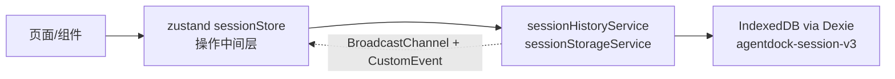
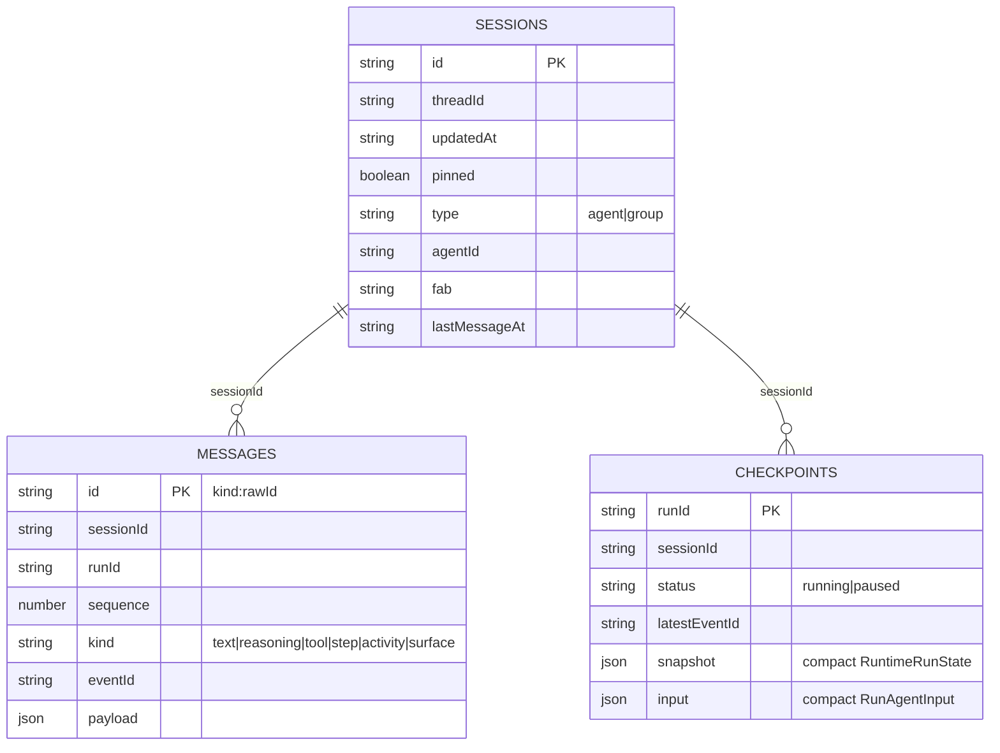

# AgentDock Chat 本地 IndexedDB 存储机制：最终设计与实现

> 日期：2026-08-24
> 状态：已实现并全量验证（typecheck / 45 项测试 / build / headless 冒烟）
> 范围：会话、消息、运行检查点的本地持久化；容量监控预警；导出清理；分页懒加载；断线续传；跨页面同步。
> 技术选型：Dexie（用户明确要求，不用 forceStorage/localStorage 全量兜底）。

---

## 1. 目标与设计原则

存储的唯一硬目标是：**用户进入任意会话，能完整看到该会话的历史消息记录**。所有机制围绕这一点：

1. **messages 表是历史唯一权威**：渲染、编辑、删除、导出、清理都以 messages 行为准。
2. **不为“用户看不到的东西”花存储**：终态 checkpoint 不落库；checkpoint 内容压缩到渲染/续传最小集。
3. **进会话才拉消息、列表分页拉取**：海量会话/长会话不一次性全量加载。
4. **防抖写、可恢复、可迁移、跨页一致**：成熟本地存储必备的工程机制。
5. **容量可感知、可回收**：origin 级用量监控 + 预警 + 用户主动导出清理。

---

## 2. 总体架构

- **存储层**：`src/api/session/sessionHistoryService.ts`（核心 CRUD/防抖/checkpoint/分页）、`sessionStorageService.ts`（容量/导出/清理）。
- **操作中间层**：`src/stores/sessionStore.ts`（zustand）统一收敛状态与 action，模块级订阅跨页变更，页面不再各自挂监听。
- **运行态**：`runStore.ts`（zustand）只管流式 run/resume，与存储态职责分离。

---

## 3. 数据库 Schema 与迁移

库名 `agentdock-session-v3`（历史命名），Dexie schema 版本 1 → 3：

| 表 | 主键 | 索引（最终版） | 说明 |
|---|---|---|---|
| `sessions` | `id` | `threadId, updatedAt, pinned, type, agentId, fab, [agentId+fab], createdAt, lastMessageAt` | 会话元信息 |
| `messages` | `id`（`kind:rawId`） | `sessionId, runId, createdAt, sequence, [sessionId+sequence]` | 历史渲染行（text/reasoning/tool/step/activity/surface） |
| `checkpoints` | `runId` | `sessionId, threadId, status, updatedAt` | 仅 running/paused 的运行快照（压缩后） |

### 迁移清单

- **v1 → v2**：sessions 增加 `agentId/fab/[agentId+fab]/createdAt/lastMessageAt`；`upgrade` 从 messages 的 text 行最大 `createdAt` 回填 `lastMessageAt`，空会话回退 `createdAt`。
- **v2 → v3**：messages 增加 `[sessionId+sequence]` 复合索引（会话内消息分页游标）；纯索引迁移，无数据改写。
- 升级阻塞处理：`db.on('blocked')` 提示旧标签页；`db.on('versionchange')` 主动 close 释放连接。

---

## 4. 数据生命周期

### 4.1 新建会话

`createSession` 写入 sessions（`lastMessageAt` 初始化为 `createdAt`）→ 广播 `sessions-changed`（含跨标签页）。

### 4.2 流式落盘（防抖）

- `runStore.execute` 每个流式事件 → `scheduleRunCheckpoint`：按 `runId` 分槽缓存快照，空闲 **350ms** 统一 `flushRunCheckpoint`，多轮并发互不覆盖。
- `saveRunCheckpoint`：
  1. **仅 running/paused** 写 checkpoint（压缩快照 + 压缩 input）；
  2. `pruneCheckpoints` 删除本会话全部终态行（存量回收）；
  3. `persistRunSnapshot` 把快照投影为 messages 行（已存在行保留原 `sequence/createdAt/runId`，多轮时间线不乱）；
  4. 更新 sessions.updatedAt，广播 `sessions-changed` + `run-persisted`。
- 终态（success/cancelled/error）：**不落 checkpoint**，只写 messages + 更新会话时间戳。
- 页面隐藏/关闭：`pagehide` / `visibilitychange=hidden` 兜底 flush（best-effort）。

### 4.3 删除 / 编辑 / 分支替换

- `removeSession`：事务内级联删除 sessions + messages + checkpoints。
- `removeMessage(s)`：删除文本行及其后随过程块，联动清理含该消息的 checkpoint，重算 `lastMessageAt`。
- `removeTurn`：按 `runId` 整轮删除（用户文本 + 回复 + 过程块 + checkpoint）。
- `updateMessageContent`：同步消息行与 running/paused checkpoint 快照。

---

## 5. 断线/续传 eventId 链路

**存储**：checkpoint 保存 `latestEventId`（run 游标）+ `processedEventIds`（重放精确去重）+ 每条消息 `eventId`；messages 行冗余 `eventId`。

**取用**：`runStore.restoreSession` 读最新 checkpoint → `run = snapshot`；`running && latestEventId` 才续传；http 路径将陈旧 running 转 cancelled（后端无游标回放前不自动续传），下一轮上下文从 messages 表重建回填 `agent.setMessages`。

**发送**：`runStore.resume` 构造 `createRuntimeAction(input,'resume',{resume:{lastEventId: run.latestEventId}})` → `forwardedProps.resume.lastEventId` 随 POST body 发往后端 → 后端按 `eventId > lastEventId` 字符串比较回放。

**约束**：eventId 必须字符串可排序（序号定宽补零，如 `{epoch_ms}-{seq:06d}`），否则 run 超 9 个事件后 resume 会漏事件；前端只做精确去重，比较交给后端。

---

## 6. 容量监控与预警

- `getStorageUsage()`：`navigator.storage.estimate()`（origin 级）+ 三表 `count()`；百分比 <1% 按 1% 显示。
- 阈值：**70% warning / 90% critical**；`checkStorageHealth` 10s 节流 + 跨级去重，触发 `agentdock:storage-warning`（AppShell 提示，设置页展示进度条）。
- 触发时机：启动、落库后（节流）、回到前台、设置页手动刷新。
- 写库失败（QuotaExceededError 等）→ `agentdock:storage-error` 提示引导清理。

---

## 7. 导出与清理

- **选择语义**：严格以 `lastMessageAt`（会话内最后一条消息时间，非创建时间）为准；缺字段旧数据按 `updatedAt` 兜底。
- 两种模式：`{ daysAgo }`（最后消息早于 N 天前）/ `{ oldestCount }`（按最后消息时间升序取最旧 N 个）。
- `selectCleanupCandidates`：预览候选（标题 + 最后消息时间 + 消息数 + 估算体积），`daysAgo` 走 `lastMessageAt` 索引。
- `buildSessionExport`：JSON `{ app, exportType, version, exportedAt, criteria, sessions, messages, checkpoints }`，Blob 下载。
- `exportAndDeleteSessions`：**先导出、后删除**（导出失败不删；删除失败已下载文件仍有效），级联删除三表。
- 设置页 Storage Tab：进度条 + 健康状态 + 模式/数值输入（可清空自由输入，空值禁用操作）+ 预览滚动列表 + 仅导出 / 导出并删除（确认弹窗数量与当前条件一致）。

---

## 8. 分页与懒加载

### 8.1 会话列表

- `listSessions({ limit, offset })` 走 `updatedAt` 倒序索引 + `countSessions()`；`sessionStore` 首屏 50 条窗口 + `loadMoreSessions()`。
- HomeSidebar「加载更多」；搜索态走 `searchSessions` 全量扫标题/Agent 名。
- Agent 话题 / 群组列表改用 `listSessionsByAgent`（`[agentId+fab]` 索引）/ `listGroupSessions`（type 索引），各自带加载更多。

### 8.2 会话内消息

- `getMessagesPage({ beforeSequence, limit })`：以“文本所属 run”为最小完整单位——每页取最近 N 条文本并整轮装载过程块，分页边界不切断一轮；`hasMore` 用 `[sessionId+sequence]` 索引探测。
- ChatPage/GroupChatPage：首屏最近 50 条文本 + 「加载更早消息」；删除/编辑/终态后按“当前已加载文本数”重取窗口，保留已加载的更早内容。

---

## 9. 跨页面同步

- 双通道：同窗口 `CustomEvent`（`sessions-changed` / `run-persisted`）+ 跨标签页 `BroadcastChannel('agentdock:session-sync')`。
- `subscribeSessionChanges(cb)` 统一订阅；`sessionStore` 模块级订阅 → 自动刷新列表与容量。
- schema 升级：`blocked`/`versionchange` 监听 + 主动 close，避免多标签页互锁。

---

## 10. 错误处理与诊断

- 写库守卫 `guardWrite`：捕获落库异常 → `agentdock:storage-error` → 原样抛出。
- `withBlockedDiagnostic`：操作超 3s 告警（可能被旧标签页阻塞）。
- 启动清扫 `sweepTerminalCheckpoints`：幂等删除存量终态 checkpoint（历史不受影响）。
- 旧格式 checkpoint 读取时惰性压缩重写（一次性回收空间）。

---

## 11. 与 LobeHub 对比与借鉴

| 机制 | LobeHub | AgentDock |
|---|---|---|
| Schema 演进 | Dexie version(1..11) + upgrade 回填 | version(1..3) + upgrade 回填 |
| 写入校验 | zod safeParse | 关键字段类型由 TS 约束（后续可加 zod） |
| 复合索引 | `[sessionId+topicId]` | `[agentId+fab]`、`[sessionId+sequence]` |
| 容量展示 | `navigator.storage.estimate()` | 同款 + 阈值预警 + 清理入口 |
| 导出 | exportType/state/version JSON | 同构 JSON + 按条件导出删除 |
| checkpoint | 保留全量快照 | 终态不落库 + running/paused 压缩快照 |

canary 已演进为服务端 DB + 单记录库缓存；AgentDock 是纯本地优先场景，保留 Dexie 索引能力，不退化。

---

## 12. 测试与验证

`src/api/session/*.test.ts`（fake-indexeddb + node:test）覆盖：

- 落库/恢复/多轮顺序/防抖分槽/占位行过滤；
- lastMessageAt 维护、v1→v2 回填迁移；
- checkpoint 剪枝（终态全清、running 保留）、压缩、存量惰性压缩、启动清扫；
- 断线续传 eventId 存储→取用→resume.lastEventId 构造；
- 会话列表分页（limit/offset）、消息按 run 整轮分页（无重叠、顺序、hasMore 收敛）；
- 容量筛选（daysAgo/oldestCount/兜底）、导出结构、级联删除、先导出后删除。

全量：`pnpm typecheck`、`pnpm test`（45/45）、`pnpm build`、headless Chrome 冒烟（/chat /group /settings）。

---

## 13. 后续可演进项

- `persistRunSnapshot` 差量 upsert（跳过无变化行，降低写放大）。
- zod 写入校验与 group 配置 schema。
- tool result / surface 大字段的可选截断策略（涉及“完整使用”取舍，需产品决策）。
- 全文搜索索引表（跨会话消息搜索）。
- 归档/软删除（`archivedAt` + 索引）。

---

## 14. 关键文件

- `src/api/session/sessionHistoryService.ts`：Dexie schema/迁移、CRUD、防抖、checkpoint 生命周期、分页、跨页订阅。
- `src/api/session/sessionStorageService.ts`：容量估算/预警、清理候选、导出、级联删除。
- `src/stores/sessionStore.ts`：zustand 操作中间层（列表分页窗口、容量、清理）。
- `src/stores/runStore.ts`：运行态与断线续传。
- `src/features/settings/SettingsPage.tsx`：Storage Tab（容量 + 导出清理）。
- `src/features/chat/ChatPage.tsx` / `src/features/group/GroupChatPage.tsx`：消息分页懒加载。
- 迁移前分析：`INDEXEDDB_SCHEMA_ANALYSIS.md`；迭代设计：`docs/agentdock/design/16-indexeddb-storage-plan.md`。
